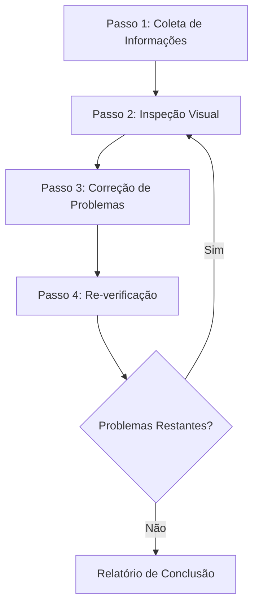
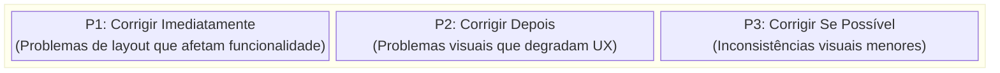
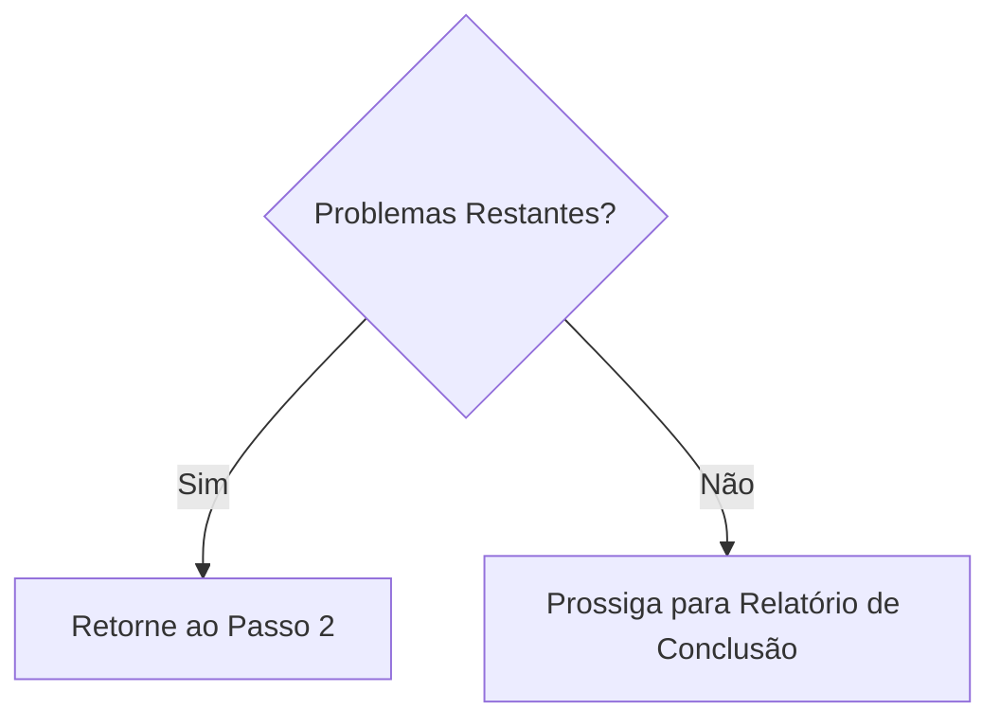

# Web Design Reviewer

Esta habilidade permite inspeção visual e validação da qualidade de design de sites, identificando e corrigindo problemas no nível do código-fonte.

## Escopo de Aplicação

- Sites estáticos (HTML/CSS/JS)
- Frameworks SPA como React / Vue / Angular / Svelte
- Frameworks full-stack como Next.js / Nuxt / SvelteKit
- Plataformas CMS como WordPress / Drupal
- Qualquer outra aplicação web

## Pré-requisitos

### Obrigatórios

1. **O site alvo deve estar em execução**
   - Servidor de desenvolvimento local (ex: `http://localhost:3000`)
   - Ambiente de staging
   - Ambiente de produção (apenas para revisões de leitura)

2. **Automação de navegador deve estar disponível**
   - Captura de screenshots
   - Navegação de páginas
   - Recuperação de informações do DOM

3. **Acesso ao código-fonte (ao fazer correções)**
   - Projeto deve existir no workspace

## Visão Geral do Fluxo de Trabalho



---

## Passo 1: Fase de Coleta de Informações

### 1.1 Confirmação da URL

Se a URL não for fornecida, solicite ao usuário:

> Forneça a URL do site a revisar (ex: `http://localhost:3000`)

### 1.2 Entendimento da Estrutura do Projeto

Ao fazer correções, colete as seguintes informações:

| Item | Pergunta Exemplo |
|------|------------------|
| Framework | Você está usando React / Vue / Next.js, etc.? |
| Método de Estilo | CSS / SCSS / Tailwind / CSS-in-JS, etc. |
| Localização do Código-fonte | Onde estão localizados os arquivos de estilo e componentes? |
| Escopo da Revisão | Apenas páginas específicas ou o site inteiro? |

### 1.3 Detecção Automática do Projeto

Tente detectar automaticamente a partir de arquivos no workspace:

```
Destinos de detecção:
├── package.json     → Framework e dependências
├── tsconfig.json    → Uso de TypeScript
├── tailwind.config  → Tailwind CSS
├── next.config      → Next.js
├── vite.config      → Vite
├── nuxt.config      → Nuxt
└── src/ ou app/     → Diretório de código-fonte
```

### 1.4 Identificação do Método de Estilo

| Método | Detecção | Alvo de Edição |
|--------|----------|------------------|
| CSS Puro | Arquivos `*.css` | CSS global ou CSS de componente |
| SCSS/Sass | `*.scss`, `*.sass` | Arquivos SCSS |
| CSS Modules | `*.module.css` | Arquivos de módulo CSS |
| Tailwind CSS | `tailwind.config.*` | className em componentes |
| styled-components | `styled.` no código | Arquivos JS/TS |
| Emotion | Importações `@emotion/` | Arquivos JS/TS |
| CSS-in-JS (outro) | Estilos inline | Arquivos JS/TS |

---

## Passo 2: Fase de Inspeção Visual

### 2.1 Travessia de Páginas

1. Navegue até a URL especificada
2. Capture screenshots
3. Recupere a estrutura do DOM/snapshot (se possível)
4. Se existirem páginas adicionais, percorra a navegação

### 2.2 Itens de Inspeção

#### Problemas de Layout

| Problema | Descrição | Severidade |
|----------|-----------|-----------|
| Overflow de Elemento | Conteúdo transborda do elemento pai ou viewport | Alta |
| Sobreposição de Elemento | Sobreposição não intencional de elementos | Alta |
| Problemas de Alinhamento | Problemas de alinhamento em grid ou flex | Média |
| Espaçamento Inconsistente | Inconsistências em padding/margin | Média |
| Texto Cortado | Texto longo não tratado adequadamente | Média |

#### Problemas de Responsividade

| Problema | Descrição | Severidade |
|----------|-----------|-----------|
| Não é Mobile Friendly | Layout quebrado em telas pequenas | Alta |
| Problemas de Breakpoint | Transições desnatural quando o tamanho da tela muda | Média |
| Alvo de Toque | Botões muito pequenos em celular | Média |

#### Problemas de Acessibilidade

| Problema | Descrição | Severidade |
|----------|-----------|-----------|
| Contraste Insuficiente | Razão de contraste baixa entre texto e fundo | Alta |
| Sem Estado de Foco | Não é possível determinar estado durante navegação por teclado | Alta |
| Falta de Texto Alternativo | Sem texto alternativo para imagens | Média |

#### Consistência Visual

| Problema | Descrição | Severidade |
|----------|-----------|-----------|
| Inconsistência de Fonte | Familias de fontes mistas | Média |
| Inconsistência de Cor | Cores de marca não unificadas | Média |
| Inconsistência de Espaçamento | Espaçamento não uniforme entre elementos similares | Baixa |

### 2.3 Testes de Viewport (Responsivo)

Teste nos seguintes viewports:

| Nome | Largura | Dispositivo Representativo |
|------|---------|---------------------------|
| Mobile | 375px | iPhone SE/12 mini |
| Tablet | 768px | iPad |
| Desktop | 1280px | PC padrão |
| Wide | 1920px | Tela grande |

---

## Passo 3: Fase de Correção de Problemas

### 3.1 Priorização de Problemas



### 3.2 Identificação de Arquivos de Código-fonte

Identifique arquivos de código-fonte a partir de elementos problemáticos:

1. **Busca Baseada em Seletor**
   - Pesquise a codebase por nome de classe ou ID
   - Explore definições de estilo com `grep_search`

2. **Busca Baseada em Componente**
   - Identifique componentes a partir do texto ou estrutura do elemento
   - Explore arquivos relacionados com `semantic_search`

3. **Filtragem de Padrão de Arquivo**
   ```
   Arquivos de estilo: src/**/*.css, styles/**/*
   Componentes: src/components/**/*
   Páginas: src/pages/**, app/**
   ```

### 3.3 Aplicação de Correções

#### Diretrizes de Correção Específicas do Framework

Veja [references/framework-fixes.md](references/framework-fixes.md) para detalhes.

#### Princípios de Correção

1. **Mudanças Mínimas**: Faça apenas as mudanças mínimas necessárias para resolver o problema
2. **Respeite Padrões Existentes**: Siga o estilo de código existente no projeto
3. **Evite Mudanças Que Quebrem**: Tenha cuidado para não afetar outras áreas
4. **Adicione Comentários**: Adicione comentários para explicar o motivo das correções quando apropriado

---

## Passo 4: Fase de Re-verificação

### 4.1 Confirmação Pós-correção

1. Recarregue o navegador (ou aguarde HMR do servidor de desenvolvimento)
2. Capture screenshots das áreas corrigidas
3. Compare antes e depois

### 4.2 Testes de Regressão

- Verifique que as correções não afetaram outras áreas
- Confirme que o display responsivo não foi quebrado

### 4.3 Decisão de Iteração



**Limite de Iteração**: Se mais de 3 tentativas de correção forem necessárias para um problema específico, consulte o usuário

---

## Formato de Saída

### Relatório de Resultados da Revisão

```markdown
# Resultados da Revisão de Design Web

## Resumo

| Item | Valor |
|------|-------|
| URL Alvo | {URL} |
| Framework | {Framework detectado} |
| Estilo | {CSS / Tailwind / etc.} |
| Viewports Testados | Desktop, Mobile |
| Problemas Detectados | {N} |
| Problemas Corrigidos | {M} |

## Problemas Detectados

### [P1] {Título do Problema}

- **Página**: {Caminho da página}
- **Elemento**: {Seletor ou descrição}
- **Problema**: {Descrição detalhada do problema}
- **Arquivo Corrigido**: `{Caminho do arquivo}`
- **Detalhes da Correção**: {Descrição das mudanças}
- **Screenshot**: Antes/Depois

### [P2] {Título do Problema}
...

## Problemas Não Corrigidos (se houver)

### {Título do Problema}
- **Motivo**: {Por que não foi corrigido/não pôde ser corrigido}
- **Ação Recomendada**: {Recomendações para o usuário}

## Recomendações

- {Sugestões para melhorias futuras}
```

---

## Capacidades Obrigatórias

| Capacidade | Descrição | Obrigatória |
|-----------|-----------|-----------|
| Navegação de Página Web | Acesso a URLs, transições de página | ✅ |
| Captura de Screenshot | Captura de imagem de página | ✅ |
| Análise de Imagem | Detecção de problemas visuais | ✅ |
| Recuperação de DOM | Recuperação de estrutura de página | Recomendado |
| Leitura/Escrita de Arquivo | Leitura e edição de código-fonte | Obrigatória para correções |
| Busca de Código | Busca de código dentro do projeto | Obrigatória para correções |

---

## Implementação de Referência

### Implementação com Playwright MCP

[Playwright MCP](https://github.com/microsoft/playwright-mcp) é recomendado como implementação de referência para esta habilidade.

| Capacidade | Ferramenta Playwright MCP | Propósito |
|-----------|--------------------------|----------|
| Navegação | `browser_navigate` | Acesso a URLs |
| Snapshot | `browser_snapshot` | Recuperação de estrutura do DOM |
| Screenshot | `browser_take_screenshot` | Imagens para inspeção visual |
| Click | `browser_click` | Interação com elementos interativos |
| Resize | `browser_resize` | Testes responsivos |
| Console | `browser_console_messages` | Detecção de erros JS |

#### Exemplo de Configuração (MCP Server)

```json
{
  "mcpServers": {
    "playwright": {
      "command": "npx",
      "args": ["-y", "@playwright/mcp@latest", "--caps=vision"]
    }
  }
}
```

### Outras Ferramentas de Automação de Navegador Compatíveis

| Ferramenta | Características |
|-----------|-----------------|
| Selenium | Suporte amplo de navegadores, suporte multi-linguagem |
| Puppeteer | Foco em Chrome/Chromium, Node.js |
| Cypress | Fácil integração com testes E2E |
| WebDriver BiDi | Protocolo padronizado de próxima geração |

O mesmo fluxo de trabalho pode ser implementado com essas ferramentas. Enquanto fornecerem as capacidades necessárias (navegação, screenshot, recuperação de DOM), a escolha da ferramenta é flexível.

---

## Melhores Práticas

### FAÇA (Recomendado)

- ✅ Sempre salve screenshots antes de fazer correções
- ✅ Corrija um problema por vez e verifique cada um
- ✅ Siga o estilo de código existente do projeto
- ✅ Confirme com o usuário antes de mudanças grandes
- ✅ Documente detalhes das correções completamente

### NÃO FAÇA (Não Recomendado)

- ❌ Refatoração em larga escala sem confirmação
- ❌ Ignorar design systems ou diretrizes de marca
- ❌ Correções que ignoram performance
- ❌ Corrigir múltiplos problemas de uma vez (difícil de verificar)

---

## Solução de Problemas

### Problema: Arquivos de estilo não encontrados

1. Verifique dependências em `package.json`
2. Considere a possibilidade de CSS-in-JS
3. Considere CSS gerado em tempo de build
4. Pergunte ao usuário sobre o método de estilo

### Problema: Correções não refletidas

1. Verifique se HMR do servidor de desenvolvimento está funcionando
2. Limpe o cache do navegador
3. Reconstrua se o projeto requer build
4. Verifique problemas de especificidade CSS

### Problema: Correções afetando outras áreas

1. Reverta as mudanças
2. Use seletores mais específicos
3. Considere usar CSS Modules ou estilos com escopo
4. Consulte o usuário para confirmar escopo de impacto