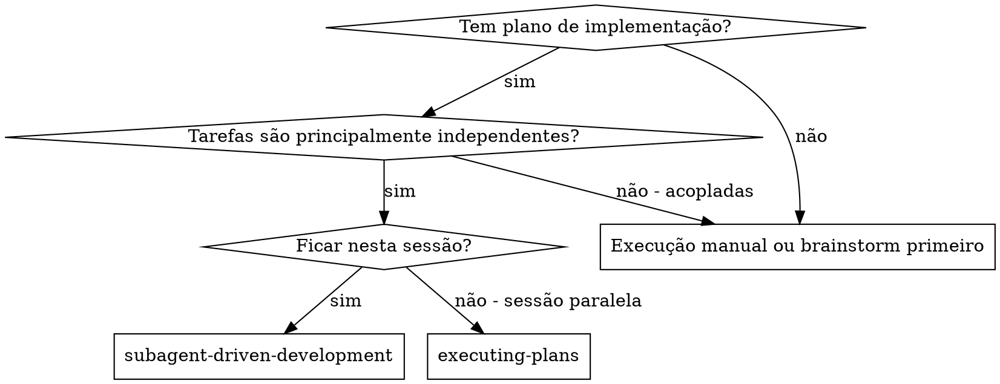
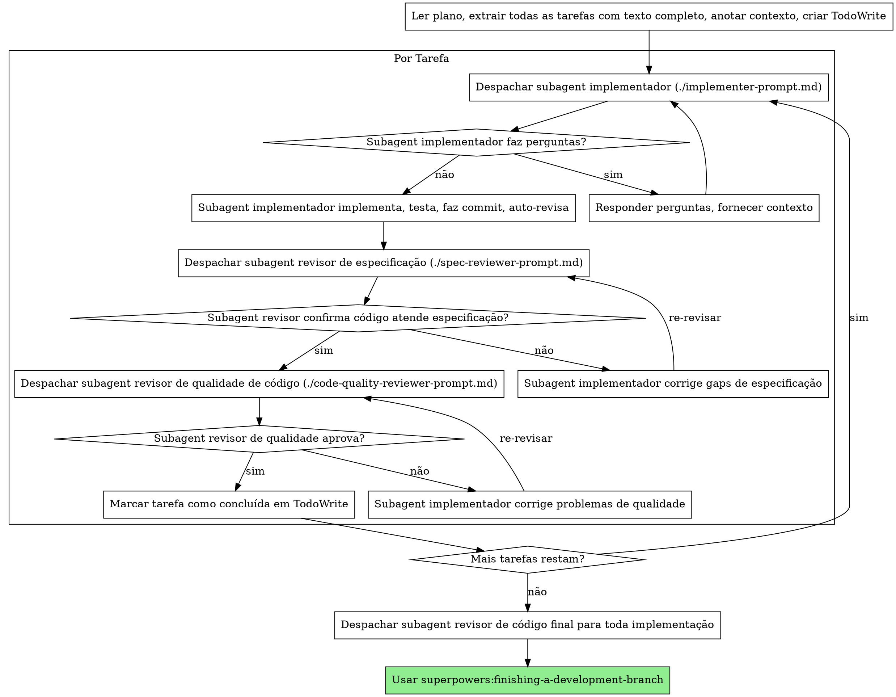

# Desenvolvimento Orientado por Subagents

Execute plano despachando um subagent fresco por tarefa, com revisão em dois estágios após cada uma: revisão de conformidade com especificação primeiro, depois revisão de qualidade de código.

**Princípio central:** Um subagent fresco por tarefa + revisão em dois estágios (especificação depois qualidade) = alta qualidade, iteração rápida

## Quando Usar



**vs. Executing Plans (sessão paralela):**
- Mesma sessão (sem mudança de contexto)
- Um subagent fresco por tarefa (sem poluição de contexto)
- Revisão em dois estágios após cada tarefa: conformidade com especificação primeiro, depois qualidade de código
- Iteração mais rápida (sem humano no meio das tarefas)

## O Processo



## Templates de Prompt

- `./implementer-prompt.md` - Despachar subagent implementador
- `./spec-reviewer-prompt.md` - Despachar subagent revisor de conformidade com especificação
- `./code-quality-reviewer-prompt.md` - Despachar subagent revisor de qualidade de código

## Exemplo de Workflow

```
Você: Estou usando Subagent-Driven Development para executar este plano.

[Ler arquivo de plano uma vez: docs/plans/feature-plan.md]
[Extrair todas as 5 tarefas com texto completo e contexto]
[Criar TodoWrite com todas as tarefas]

Tarefa 1: Script de instalação de hook

[Obter texto e contexto da Tarefa 1 (já extraído)]
[Despachar subagent de implementação com texto completo da tarefa + contexto]

Implementador: "Antes de começar - o hook deve ser instalado no nível de usuário ou sistema?"

Você: "Nível de usuário (~/.config/superpowers/hooks/)"

Implementador: "Entendi. Implementando agora..."
[Depois] Implementador:
  - Implementou comando install-hook
  - Adicionou testes, 5/5 passando
  - Auto-revisão: Percebi que faltava flag --force, adicionei
  - Fez commit

[Despachar revisor de conformidade com especificação]
Revisor de especificação: ✅ Atende especificação - todos os requisitos cumpridos, nada extra

[Obter SHAs do git, despachar revisor de qualidade de código]
Revisor de código: Pontos fortes: Boa cobertura de testes, limpo. Problemas: Nenhum. Aprovado.

[Marcar Tarefa 1 como concluída]

Tarefa 2: Modos de recuperação

[Obter texto e contexto da Tarefa 2 (já extraído)]
[Despachar subagent de implementação com texto completo da tarefa + contexto]

Implementador: [Sem perguntas, procede]
Implementador:
  - Adicionou modos verify/repair
  - 8/8 testes passando
  - Auto-revisão: Tudo bem
  - Fez commit

[Despachar revisor de conformidade com especificação]
Revisor de especificação: ❌ Problemas:
  - Faltando: Reporte de progresso (especificação diz "relatar a cada 100 itens")
  - Extra: Adicionou flag --json (não solicitado)

[Implementador corrige problemas]
Implementador: Removeu flag --json, adicionou reporte de progresso

[Revisor de especificação revisa novamente]
Revisor de especificação: ✅ Atende especificação agora

[Despachar revisor de qualidade de código]
Revisor de código: Pontos fortes: Sólido. Problemas (Importante): Número mágico (100)

[Implementador corrige]
Implementador: Extraiu constante PROGRESS_INTERVAL

[Revisor de código revisa novamente]
Revisor de código: ✅ Aprovado

[Marcar Tarefa 2 como concluída]

...

[Após todas as tarefas]
[Despachar revisor de código final]
Revisor final: Todos os requisitos cumpridos, pronto para merge

Pronto!
```

## Vantagens

**vs. Execução manual:**
- Subagents seguem TDD naturalmente
- Contexto fresco por tarefa (sem confusão)
- Seguro para paralelismo (subagents não interferem)
- Subagent pode fazer perguntas (antes E durante o trabalho)

**vs. Executing Plans:**
- Mesma sessão (sem handoff)
- Progresso contínuo (sem espera)
- Checkpoints de revisão automáticos

**Ganhos de eficiência:**
- Sem overhead de leitura de arquivo (controlador fornece texto completo)
- Controlador cuida do contexto exato necessário
- Subagent obtém informação completa antecipadamente
- Perguntas surfam antes do trabalho começar (não depois)

**Gates de qualidade:**
- Auto-revisão encontra problemas antes do handoff
- Revisão em dois estágios: conformidade com especificação, depois qualidade de código
- Loops de revisão garantem que correções funcionam
- Conformidade com especificação previne over/under-building
- Qualidade de código garante que implementação é bem construída

**Custo:**
- Mais invocações de subagent (implementador + 2 revisores por tarefa)
- Controlador faz mais trabalho de preparação (extraindo todas as tarefas antecipadamente)
- Loops de revisão adicionam iterações
- Mas encontra problemas cedo (mais barato que debugar depois)

## Red Flags

**Nunca:**
- Pular revisões (conformidade com especificação OU qualidade de código)
- Prosseguir com problemas não corrigidos
- Despachar múltiplos subagents de implementação em paralelo (conflitos)
- Fazer subagent ler arquivo de plano (fornecer texto completo em vez disso)
- Pular contexto de cena (subagent precisa entender onde tarefa se encaixa)
- Ignorar perguntas do subagent (responder antes de deixá-lo prosseguir)
- Aceitar "mais ou menos" em conformidade com especificação (revisor encontrou problemas = não concluído)
- Pular loops de revisão (revisor encontrou problemas = implementador corrige = revisar novamente)
- Deixar auto-revisão do implementador substituir revisão real (ambas são necessárias)
- **Iniciar revisão de qualidade de código antes de conformidade com especificação estar ✅** (ordem errada)
- Passar para próxima tarefa enquanto qualquer revisão tiver problemas abertos

**Se subagent fizer perguntas:**
- Responder claramente e completamente
- Fornecer contexto adicional se necessário
- Não apressá-lo para implementação

**Se revisor encontrar problemas:**
- Implementador (mesmo subagent) corrige
- Revisor revisa novamente
- Repetir até aprovado
- Não pular a re-revisão

**Se subagent falhar tarefa:**
- Despachar subagent corrigidor com instruções específicas
- Não tentar corrigir manualmente (poluição de contexto)

## Integração

**Skills de workflow necessárias:**
- **superpowers:writing-plans** - Cria o plano que este skill executa
- **superpowers:requesting-code-review** - Template de code review para subagents revisores
- **superpowers:finishing-a-development-branch** - Completar desenvolvimento após todas as tarefas

**Subagents devem usar:**
- **superpowers:test-driven-development** - Subagents seguem TDD para cada tarefa

**Workflow alternativo:**
- **superpowers:executing-plans** - Usar para sessão paralela em vez de execução na mesma sessão