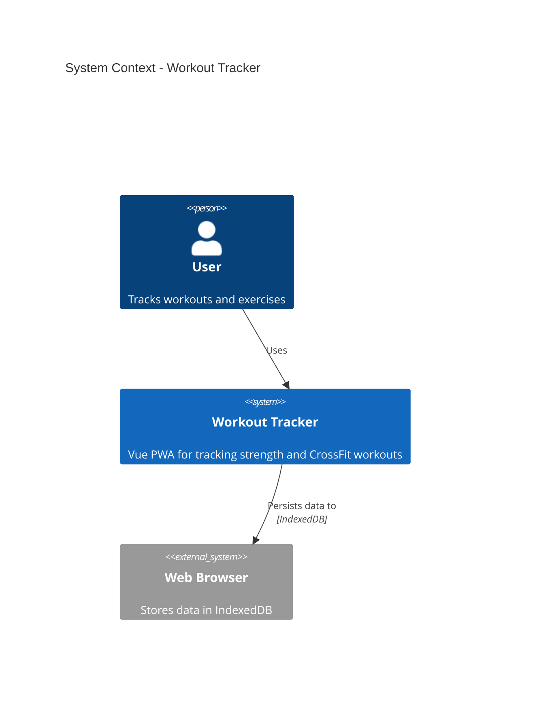
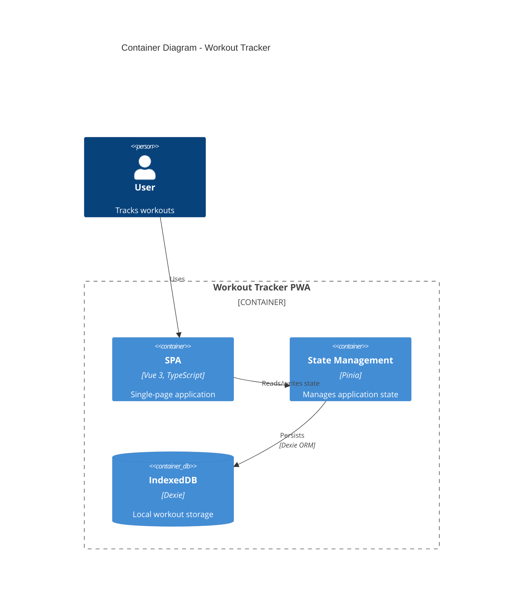
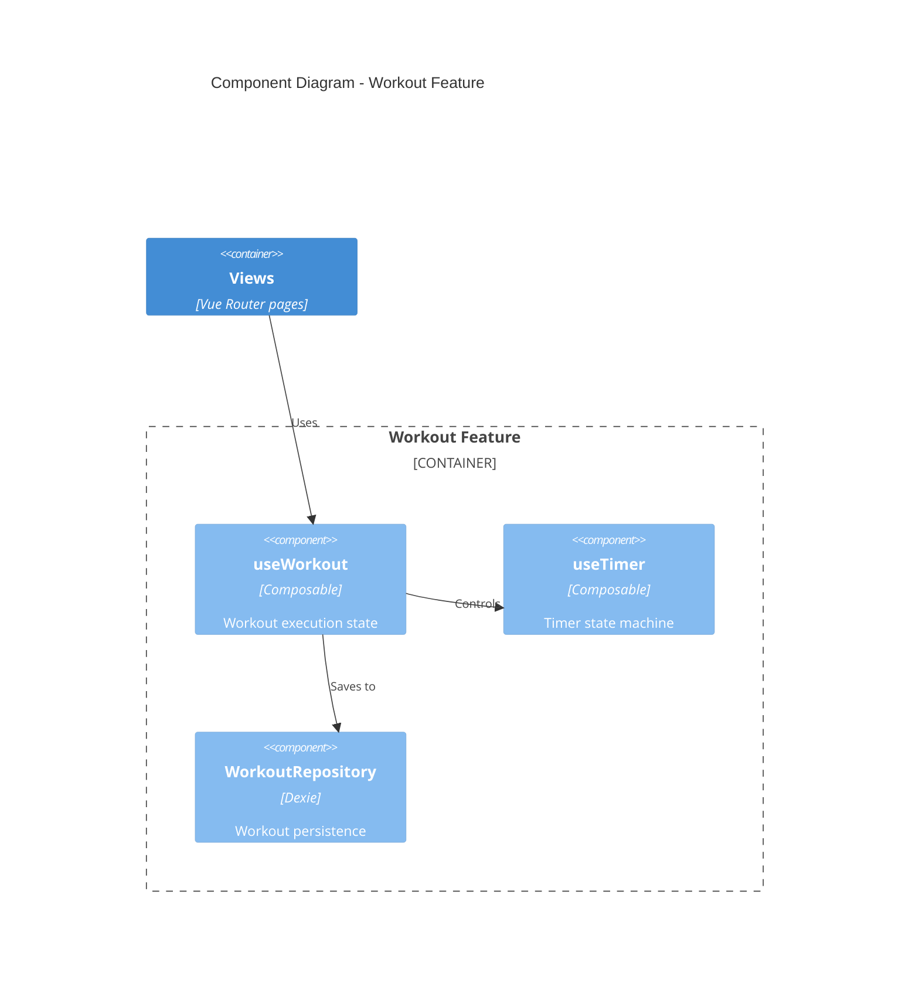
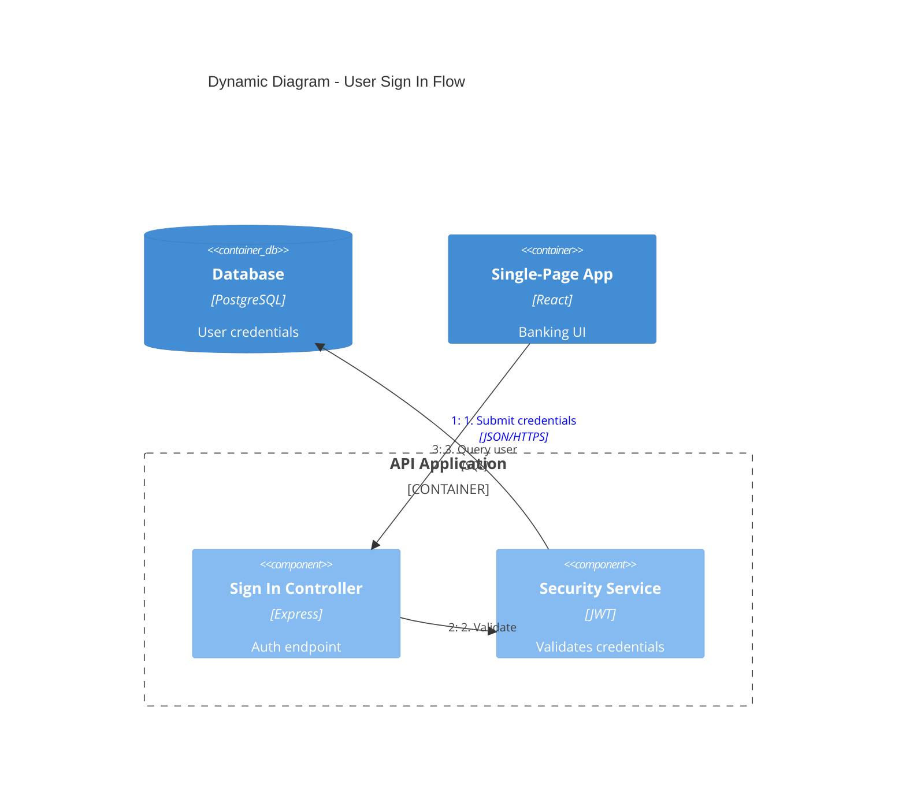
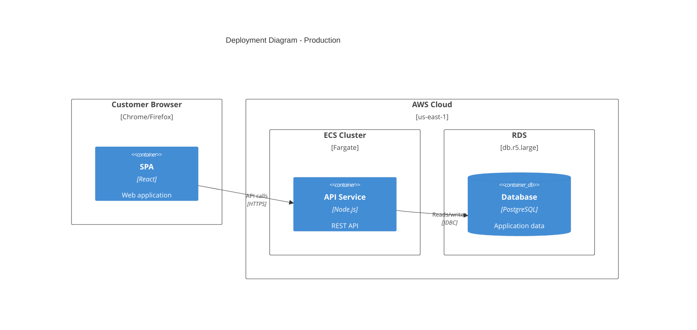
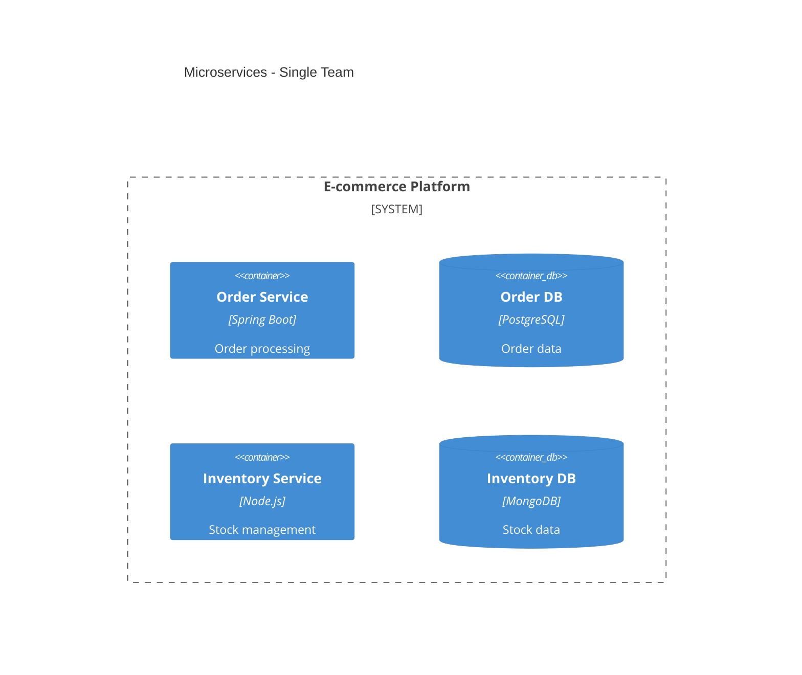
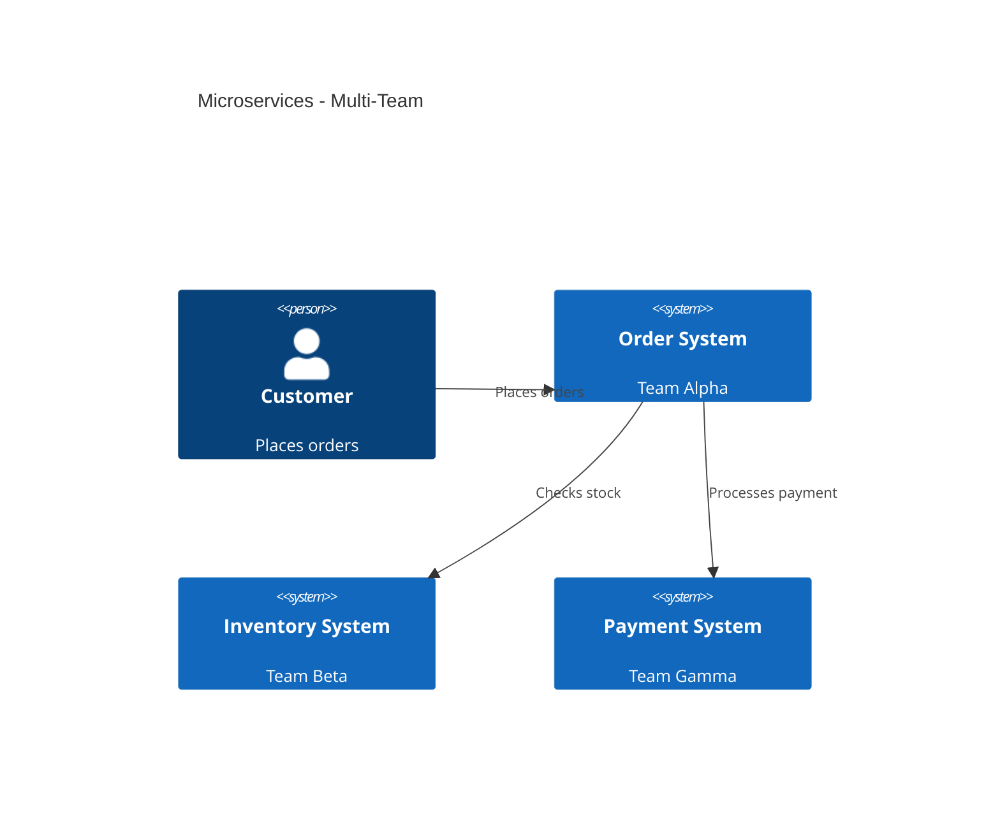
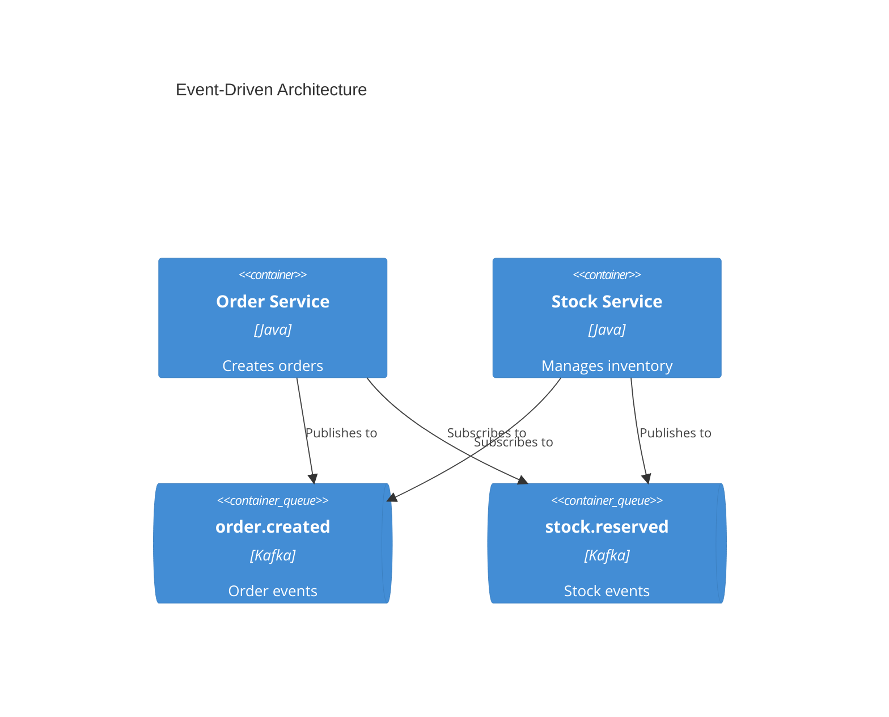

# Documentação de Arquitetura C4

Gere documentação de arquitetura de software usando diagramas C4 model em sintaxe Mermaid.

## Fluxo de Trabalho

1. **Entenda o escopo** - Determine qual(is) nível(is) C4 são necessários com base na audiência
2. **Analise o codebase** - Explore o sistema para identificar componentes, containers e relacionamentos
3. **Gere diagramas** - Crie diagramas C4 Mermaid nos níveis apropriados de abstração
4. **Documente** - Escreva diagramas em arquivos markdown com contexto explicativo

## Níveis de Diagrama C4

Selecione o nível apropriado com base na necessidade de documentação:

| Nível | Tipo de Diagrama | Audiência | Mostra | Quando Criar |
|-------|-------------|----------|-------|----------------|
| 1 | **C4Context** | Todos | Sistema + atores externos | Sempre (obrigatório) |
| 2 | **C4Container** | Técnico | Apps, bancos de dados, serviços | Sempre (obrigatório) |
| 3 | **C4Component** | Desenvolvedores | Componentes internos | Apenas se adiciona valor |
| 4 | **C4Deployment** | DevOps | Nós de infraestrutura | Para sistemas em produção |
| - | **C4Dynamic** | Técnico | Fluxos de requisição (numerados) | Para workflows complexos |

**Insight-chave:** "Diagramas de Contexto + Container são suficientes para a maioria dos times de desenvolvimento de software." Crie diagramas de Componente/Código apenas quando adicionarem valor genuíno.

## Exemplos de Início Rápido

### Contexto do Sistema (Nível 1)


### Diagrama de Container (Nível 2)


### Diagrama de Componente (Nível 3)


### Diagrama Dinâmico (Fluxo de Requisição)


### Diagrama de Deployment


## Sintaxe de Elementos

### Pessoas e Sistemas
```
Person(alias, "Label", "Description")
Person_Ext(alias, "Label", "Description")       # External person
System(alias, "Label", "Description")
System_Ext(alias, "Label", "Description")       # External system
SystemDb(alias, "Label", "Description")         # Database system
SystemQueue(alias, "Label", "Description")      # Queue system
```

### Containers
```
Container(alias, "Label", "Technology", "Description")
Container_Ext(alias, "Label", "Technology", "Description")
ContainerDb(alias, "Label", "Technology", "Description")
ContainerQueue(alias, "Label", "Technology", "Description")
```

### Componentes
```
Component(alias, "Label", "Technology", "Description")
Component_Ext(alias, "Label", "Technology", "Description")
ComponentDb(alias, "Label", "Technology", "Description")
```

### Limites
```
Enterprise_Boundary(alias, "Label") { ... }
System_Boundary(alias, "Label") { ... }
Container_Boundary(alias, "Label") { ... }
Boundary(alias, "Label", "type") { ... }
```

### Relacionamentos
```
Rel(from, to, "Label")
Rel(from, to, "Label", "Technology")
BiRel(from, to, "Label")                        # Bidirectional
Rel_U(from, to, "Label")                        # Upward
Rel_D(from, to, "Label")                        # Downward
Rel_L(from, to, "Label")                        # Leftward
Rel_R(from, to, "Label")                        # Rightward
```

### Nós de Deployment
```
Deployment_Node(alias, "Label", "Type", "Description") { ... }
Node(alias, "Label", "Type", "Description") { ... }  # Shorthand
```

## Estilo e Layout

### Configuração de Layout
```
UpdateLayoutConfig($c4ShapeInRow="3", $c4BoundaryInRow="1")
```
- `$c4ShapeInRow` - Número de formas por linha (padrão: 4)
- `$c4BoundaryInRow` - Número de limites por linha (padrão: 2)

### Estilo de Elementos
```
UpdateElementStyle(alias, $fontColor="red", $bgColor="grey", $borderColor="red")
```

### Estilo de Relacionamentos
```
UpdateRelStyle(from, to, $textColor="blue", $lineColor="blue", $offsetX="5", $offsetY="-10")
```
Use `$offsetX` e `$offsetY` para corrigir rótulos de relacionamento sobrepostos.

## Melhores Práticas

### Regras Essenciais

1. **Todo elemento deve ter**: Nome, Tipo, Tecnologia (quando aplicável) e Descrição
2. **Use apenas setas unidirecionais** - Setas bidirecionais criam ambiguidade
3. **Rotule setas com verbos de ação** - "Envia email usando", "Lê de", não apenas "usa"
4. **Inclua rótulos de tecnologia** - "JSON/HTTPS", "JDBC", "gRPC"
5. **Fique abaixo de 20 elementos por diagrama** - Divida sistemas complexos em múltiplos diagramas

### Diretrizes de Clareza

1. **Comece no Nível 1** - Diagramas de contexto ajudam a enquadrar o escopo do sistema
2. **Um diagrama por arquivo** - Mantenha diagramas focados em um único nível de abstração
3. **Aliases significativos** - Use aliases descritivos (ex: `orderService` não `s1`)
4. **Descrições concisas** - Mantenha descrições abaixo de 50 caracteres quando possível
5. **Sempre inclua um título** - "Diagrama de contexto do sistema para [Nome do Sistema]"

### O que Evitar

Veja [references/common-mistakes.md](references/common-mistakes.md) para anti-padrões detalhados:
- Confundir containers (deployáveis) vs componentes (não-deployáveis)
- Modelar bibliotecas compartilhadas como containers
- Mostrar message brokers como containers únicos em vez de tópicos individuais
- Adicionar níveis de abstração indefinidos como "subcomponentes"
- Remover rótulos de tipo para "simplificar" diagramas

## Diretrizes para Microsserviços

### Propriedade de Time Único
Modele cada microsserviço como um **container** (ou grupo de containers):


### Propriedade de Times Múltiplos
Promova microsserviços para **software systems** quando owned por times separados:


### Arquitetura Orientada por Eventos
Mostre tópicos/filas individuais como containers, NÃO um único box "Kafka":


## Local de Saída

Escreva documentação de arquitetura para `docs/architecture/` com convenção de nomenclatura:
- `c4-context.md` - Diagrama de contexto do sistema
- `c4-containers.md` - Diagrama de container
- `c4-components-{feature}.md` - Diagramas de componente por feature
- `c4-deployment.md` - Diagrama de deployment
- `c4-dynamic-{flow}.md` - Diagramas dinâmicos para fluxos específicos

## Detalhe Apropriado para Audiência

| Audiência | Diagramas Recomendados |
|----------|---------------------|
| Executivos | Apenas contexto do sistema |
| Product Managers | Contexto + Container |
| Arquitetos | Contexto + Container + Componentes-chave |
| Desenvolvedores | Todos os níveis conforme necessário |
| DevOps | Container + Deployment |

## Referências

- [references/c4-syntax.md](references/c4-syntax.md) - Sintaxe Mermaid C4 completa
- [references/common-mistakes.md](references/common-mistakes.md) - Anti-padrões a evitar
- [references/advanced-patterns.md](references/advanced-patterns.md) - Microsserviços, event-driven, deployment