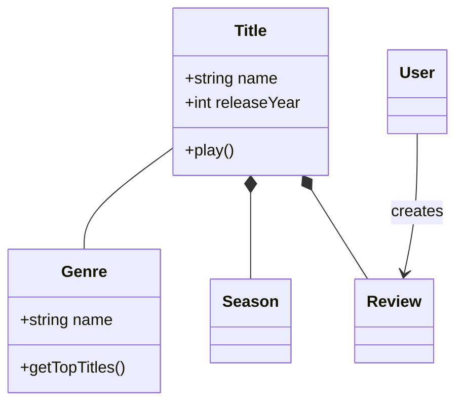
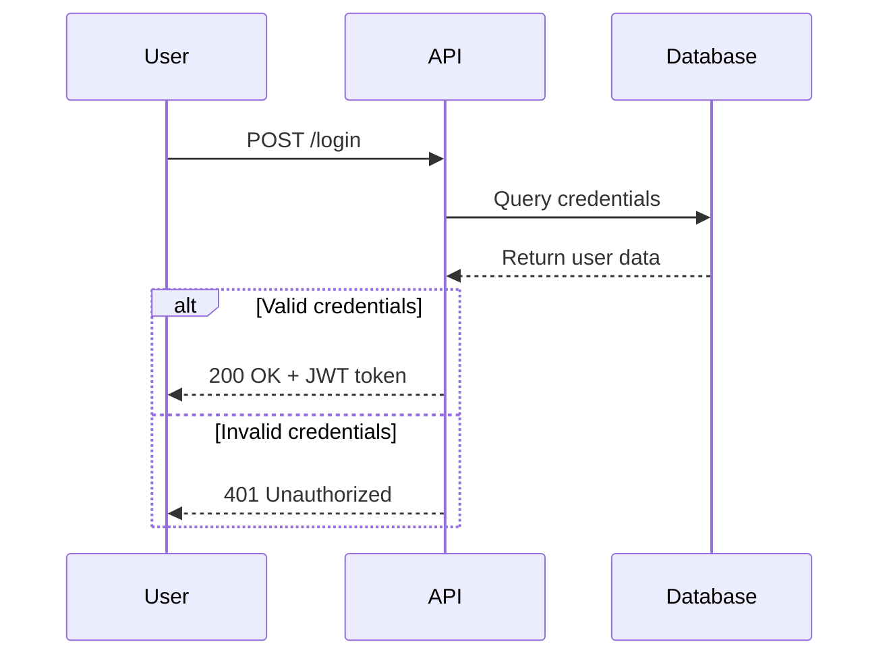
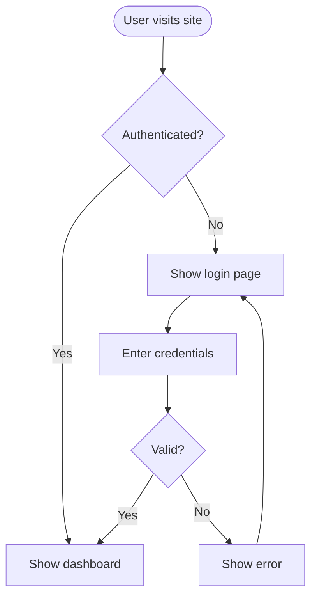
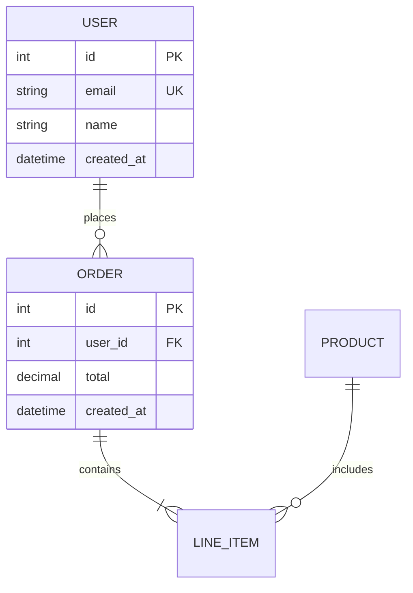
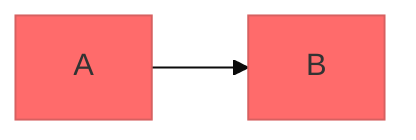

# Diagramação com Mermaid

Crie diagramas de software profissionais usando a sintaxe baseada em texto do Mermaid. O Mermaid renderiza diagramas a partir de definições simples em texto, tornando os diagramas controláveis por versão, fáceis de atualizar e mantíveis junto ao código.

## Estrutura de Sintaxe Base

Todos os diagramas Mermaid seguem este padrão:

```mermaid
diagramType
  definition content
```

**Princípios-chave:**
- Primeira linha declara tipo de diagrama (ex: `classDiagram`, `sequenceDiagram`, `flowchart`)
- Use `%%` para comentários
- Quebras de linha e indentação melhoram a legibilidade, mas não são obrigatórias
- Palavras desconhecidas quebram diagramas; parâmetros falham silenciosamente

## Guia de Seleção de Tipo de Diagrama

**Escolha o tipo de diagrama correto:**

1. **Diagramas de Classe** - Modelagem de domínio, design OOP, relacionamentos de entidades
   - Documentação de design dirigido por domínio
   - Estruturas de classe orientadas a objetos
   - Relacionamentos e dependências de entidades

2. **Diagramas de Sequência** - Interações temporais, fluxos de mensagens
   - Fluxos de requisição/resposta de API
   - Fluxos de autenticação de usuário
   - Interações de componentes do sistema
   - Sequências de chamadas de método

3. **Fluxogramas** - Processos, algoritmos, árvores de decisão
   - Jornadas de usuário e workflows
   - Processos de negócio
   - Lógica de algoritmos
   - Pipelines de deployment

4. **Diagramas de Relacionamento de Entidades (ERD)** - Esquemas de banco de dados
   - Relacionamentos de tabelas
   - Modelagem de dados
   - Design de esquema

5. **Diagramas C4** - Arquitetura de software em múltiplos níveis
   - Contexto do Sistema (sistemas e usuários)
   - Container (aplicações, bancos de dados, serviços)
   - Componente (estrutura interna)
   - Código (nível de classe/interface)

6. **Diagramas de Estado** - Máquinas de estado, estados de ciclo de vida
7. **Git Graphs** - Estratégias de branching do controle de versão
8. **Gráficos de Gantt** - Cronogramas de projeto, agendamento
9. **Gráficos de Pizza/Barras** - Visualização de dados

## Exemplos de Início Rápido

### Diagrama de Classe (Modelo de Domínio)


### Diagrama de Sequência (Fluxo de API)


### Fluxograma (Jornada do Usuário)


### ERD (Esquema de Banco de Dados)


## Referências Detalhadas

Para orientação aprofundada sobre tipos de diagrama específicos, consulte:

- **[references/class-diagrams.md](references/class-diagrams.md)** - Modelagem de domínio, relacionamentos (associação, composição, agregação, herança), multiplicidade, métodos/propriedades
- **[references/sequence-diagrams.md](references/sequence-diagrams.md)** - Atores, participantes, mensagens (síncronas/assíncronas), ativações, loops, blocos alt/opt/par, notas
- **[references/flowcharts.md](references/flowcharts.md)** - Formas de nó, conexões, lógica de decisão, subgráficos, estilização
- **[references/erd-diagrams.md](references/erd-diagrams.md)** - Entidades, relacionamentos, cardinalidade, chaves, atributos
- **[references/c4-diagrams.md](references/c4-diagrams.md)** - Contexto do sistema, container, diagramas de componentes, limites
- **[references/advanced-features.md](references/advanced-features.md)** - Temas, estilização, configuração, opções de layout

## Melhores Práticas

1. **Comece Simples** - Inicie com entidades/componentes principais, adicione detalhes incrementalmente
2. **Use Nomes Significativos** - Rótulos claros tornam diagramas autodocumentados
3. **Comente Extensivamente** - Use comentários `%%` para explicar relacionamentos complexos
4. **Mantenha Foco** - Um diagrama por conceito; divida diagramas grandes em múltiplas visualizações focadas
5. **Controle de Versão** - Armazene arquivos `.mmd` junto ao código para atualizações fáceis
6. **Adicione Contexto** - Inclua títulos e notas para explicar o propósito do diagrama
7. **Itere** - Refine diagramas conforme o entendimento evolui

## Configuração e Temas

Configure diagramas usando frontmatter:



**Temas disponíveis:** default, forest, dark, neutral, base

**Opções de layout:**
- `layout: dagre` (padrão) - Layout clássico balanceado
- `layout: elk` - Layout avançado para diagramas complexos (requer integração)

**Opções de aparência:**
- `look: classic` - Estilo Mermaid tradicional
- `look: handDrawn` - Aparência com traço de mão

## Exportação e Renderização

**Suporte nativo em:**
- GitHub/GitLab - Renderiza automaticamente em Markdown
- VS Code - Com extensão Markdown Mermaid
- Notion, Obsidian, Confluence - Suporte integrado

**Opções de exportação:**
- [Mermaid Live Editor](https://mermaid.live) - Editor online com exportação PNG/SVG
- Mermaid CLI - `npm install -g @mermaid-js/mermaid-cli` depois `mmdc -i input.mmd -o output.png`
- Docker - `docker run --rm -v $(pwd):/data minlag/mermaid-cli -i /data/input.mmd -o /data/output.png`

## Armadilhas Comuns

- **Caracteres quebrados** - Evite `{}` em comentários, use sequências de escape adequadas para caracteres especiais
- **Erros de sintaxe** - Erros de digitação quebram diagramas; valide a sintaxe no Mermaid Live
- **Complexidade excessiva** - Divida diagramas complexos em múltiplas visualizações focadas
- **Relacionamentos ausentes** - Documente todas as conexões importantes entre entidades

## Quando Criar Diagramas

**Sempre diagrame quando:**
- Iniciar novos projetos ou features
- Documentar sistemas complexos
- Explicar decisões de arquitetura
- Projetar esquemas de banco de dados
- Planejar esforços de refatoração
- Integrar novos membros da equipe

**Use diagramas para:**
- Alinhar stakeholders em decisões técnicas
- Documentar modelos de domínio colaborativamente
- Visualizar fluxos de dados e interações do sistema
- Planejar antes de codificar
- Criar documentação viva que evolui com o código