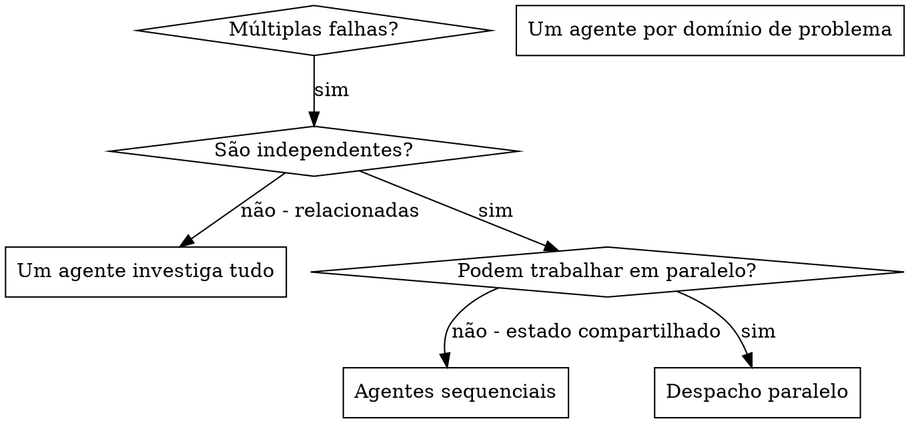

# Despachando Agentes em Paralelo

## Visão Geral

Quando você tem múltiplas falhas não relacionadas (arquivos de teste diferentes, subsistemas diferentes, bugs diferentes), investigá-las sequencialmente desperdiça tempo. Cada investigação é independente e pode acontecer em paralelo.

**Princípio central:** Despache um agente por domínio de problema independente. Deixe-os trabalhar concorrentemente.

## Quando Usar



**Use quando:**
- 3+ arquivos de teste falhando com causas raiz diferentes
- Múltiplos subsistemas quebrados independentemente
- Cada problema pode ser entendido sem contexto dos outros
- Sem estado compartilhado entre investigações

**Não use quando:**
- Falhas estão relacionadas (corrigir uma pode corrigir outras)
- Precisa entender o estado completo do sistema
- Agentes interfeririam um com o outro

## O Padrão

### 1. Identifique Domínios Independentes

Agrupe falhas pelo que está quebrado:
- Testes do arquivo A: Fluxo de aprovação de ferramentas
- Testes do arquivo B: Comportamento de conclusão de lote
- Testes do arquivo C: Funcionalidade de cancelamento

Cada domínio é independente — corrigir aprovação de ferramentas não afeta testes de cancelamento.

### 2. Crie Tarefas de Agentes Focadas

Cada agente recebe:
- **Escopo específico:** Um arquivo de teste ou subsistema
- **Objetivo claro:** Fazer estes testes passar
- **Restrições:** Não mude outro código
- **Saída esperada:** Resumo do que você encontrou e corrigiu

### 3. Despache em Paralelo

```typescript
// Em Claude Code / ambiente AI
Task("Corrigir falhas agent-tool-abort.test.ts")
Task("Corrigir falhas batch-completion-behavior.test.ts")
Task("Corrigir falhas tool-approval-race-conditions.test.ts")
// Todos os três executam concorrentemente
```

### 4. Revise e Integre

Quando agentes retornam:
- Leia cada resumo
- Verifique se correções não conflitam
- Execute a suite de testes completa
- Integre todas as mudanças

## Estrutura do Prompt de Agente

Bons prompts de agente são:
1. **Focados** - Um domínio de problema claro
2. **Autossuficientes** - Todo contexto necessário para entender o problema
3. **Específicos sobre saída** - O que o agente deve retornar?

```markdown
Corrija os 3 testes falhando em src/agents/agent-tool-abort.test.ts:

1. "should abort tool with partial output capture" - espera 'interrupted at' na mensagem
2. "should handle mixed completed and aborted tools" - ferramenta rápida cancelada em vez de concluída
3. "should properly track pendingToolCount" - espera 3 resultados mas obtém 0

Estes são problemas de timing/condição de corrida. Sua tarefa:

1. Leia o arquivo de teste e entenda o que cada teste verifica
2. Identifique a causa raiz — problemas de timing ou bugs reais?
3. Corrija por:
   - Substituir timeouts arbitrários por waiting baseado em eventos
   - Corrigir bugs na implementação de cancelamento se encontrados
   - Ajustar expectativas de teste se comportamento mudou

NÃO apenas aumente timeouts — encontre o problema real.

Retorne: Resumo do que você encontrou e o que corrigiu.
```

## Erros Comuns

**❌ Muito amplo:** "Corrija todos os testes" - agente se perde
**✅ Específico:** "Corrija agent-tool-abort.test.ts" - escopo focado

**❌ Sem contexto:** "Corrija a condição de corrida" - agente não sabe onde
**✅ Contexto:** Cole as mensagens de erro e nomes de testes

**❌ Sem restrições:** Agente pode refatorar tudo
**✅ Restrições:** "NÃO mude código de produção" ou "Corrija apenas testes"

**❌ Saída vaga:** "Corrija isso" - você não sabe o que mudou
**✅ Específico:** "Retorne resumo da causa raiz e mudanças"

## Quando NÃO Usar

**Falhas relacionadas:** Corrigir uma pode corrigir outras — investigue junto primeiro
**Precisa contexto completo:** Entender requer ver o sistema inteiro
**Debug exploratório:** Você não sabe o que está quebrado ainda
**Estado compartilhado:** Agentes interfeririam (editando mesmos arquivos, usando mesmos recursos)

## Exemplo Real de Sessão

**Cenário:** 6 testes falhando em 3 arquivos após refatoração maior

**Falhas:**
- agent-tool-abort.test.ts: 3 falhas (problemas de timing)
- batch-completion-behavior.test.ts: 2 falhas (ferramentas não executando)
- tool-approval-race-conditions.test.ts: 1 falha (contagem de execução = 0)

**Decisão:** Domínios independentes — lógica de cancelamento separada de conclusão de lote separada de condições de corrida

**Despacho:**
```
Agente 1 → Corrigir agent-tool-abort.test.ts
Agente 2 → Corrigir batch-completion-behavior.test.ts
Agente 3 → Corrigir tool-approval-race-conditions.test.ts
```

**Resultados:**
- Agente 1: Substituiu timeouts por waiting baseado em eventos
- Agente 2: Corrigiu bug de estrutura de evento (threadId no lugar errado)
- Agente 3: Adicionou wait para conclusão de execução de ferramenta assíncrona

**Integração:** Todas as correções independentes, sem conflitos, suite completa verde

**Tempo economizado:** 3 problemas resolvidos em paralelo vs sequencialmente

## Benefícios Principais

1. **Paralelização** - Múltiplas investigações acontecem simultaneamente
2. **Foco** - Cada agente tem escopo estreito, menos contexto para rastrear
3. **Independência** - Agentes não interferem um com o outro
4. **Velocidade** - 3 problemas resolvidos no tempo de 1

## Verificação

Depois que agentes retornam:
1. **Revise cada resumo** - Entenda o que mudou
2. **Verifique conflitos** - Agentes editaram o mesmo código?
3. **Execute suite completa** - Verifique se todas as correções funcionam juntas
4. **Verificação pontual** - Agentes podem cometer erros sistemáticos

## Impacto Real

Da sessão de debug (2025-10-03):
- 6 falhas em 3 arquivos
- 3 agentes despachados em paralelo
- Todas as investigações completadas concorrentemente
- Todas as correções integradas com sucesso
- Zero conflitos entre mudanças de agentes