# Especialista em Diagramas Mermaid

## Visão Geral

**Propósito**: Especialista em criar diagramas Mermaid abrangentes para
documentação, visualização de arquitetura e mapeamento de processos

**Categoria**: Tech **Usuários Principais**: tech-writer, architecture-validator,
product-technical, tech-lead

## Quando Usar Esta Habilidade

- Criando documentação de arquitetura
- Visualizando workflows e processos
- Documentando modelos de dados (DERs)
- Explicando fluxos de sequência
- Criando máquinas de estado
- Documentando relacionamentos entre componentes
- Criando árvores de decisão
- Visualizando jornadas de usuários

## Pré-requisitos

**Obrigatório:**

- Entendimento do sistema/processo a documentar
- Acesso às especificações técnicas
- Conhecimento do tipo de diagrama necessário

**Opcional:**

- Cores do design system para consistência
- Documentação existente como referência

## Input

**O que a habilidade precisa:**

- Descrição de processo/sistema
- Entidades e relacionamentos (para DERs)
- Interações entre componentes (para diagramas de sequência)
- Camadas de arquitetura (para diagramas C4)
- Estados e transições (para diagramas de estado)

## Workflow

### Etapa 1: Seleção do Tipo de Diagrama

**Objetivo**: Escolher o tipo de diagrama apropriado para os requisitos

**Tipos de Diagramas Disponíveis:**

1. **Flowchart**: Fluxos de decisão, algoritmos, processos
2. **Sequence Diagram**: Interações de API, fluxos de mensagens
3. **ERD**: Schemas de banco de dados, relacionamentos de entidades
4. **Class Diagram**: Design orientado a objetos
5. **State Diagram**: Máquinas de estado, ciclo de vida
6. **Gantt Chart**: Cronogramas de projetos, agendas
7. **C4 Diagram**: Arquitetura em diferentes níveis
8. **Pie/Bar Charts**: Visualização de dados
9. **Git Graph**: Fluxos de controle de versão
10. **User Journey**: Fluxos de experiência do usuário

**Matriz de Decisão:**

- Processo com decisões → **Flowchart**
- Interações de API/sistema → **Sequence Diagram**
- Estrutura de banco de dados → **ERD**
- Arquitetura de sistema → **C4 Diagram**
- Relacionamentos de objetos → **Class Diagram**
- Transições de estado → **State Diagram**
- Cronograma de projeto → **Gantt Chart**

**Validação:**

- [ ] Tipo de diagrama corresponde ao conteúdo
- [ ] Complexidade apropriada
- [ ] Audiência considerada
- [ ] Objetivo claro

**Output**: Tipo de diagrama selecionado

### Etapa 2: Criação de Fluxogramas

**Objetivo**: Criar diagramas de fluxo de processo e decisão

**Sintaxe:**

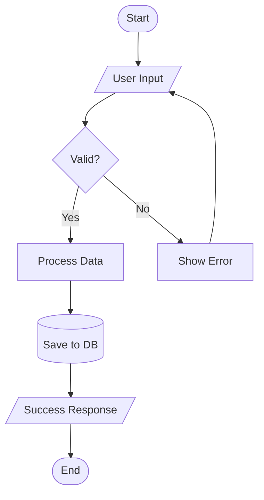

**Formatos de Nós:**

- `[Rectangle]` - Etapa de processo
- `([Rounded])` - Início/Fim
- `{Diamond}` - Decisão
- `[/Parallelogram/]` - Input/Output
- `[(Database)]` - Armazenamento de dados
- `((Circle))` - Conector

**Opções de Direção:**

- `TD` - De cima para baixo
- `LR` - Esquerda para direita
- `BT` - De baixo para cima
- `RL` - Direita para esquerda

**Exemplo - Fluxo de Reserva:**

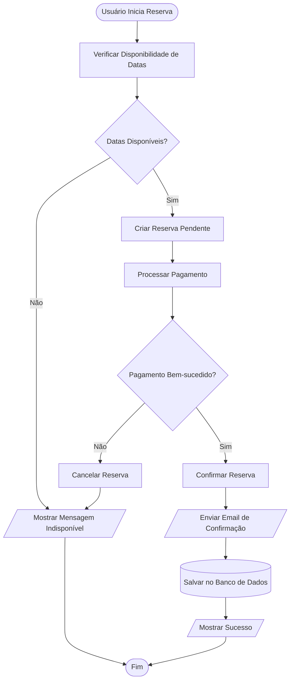

**Validação:**

- [ ] Todos os caminhos cobertos
- [ ] Pontos de decisão claros
- [ ] Início e fim definidos
- [ ] Direção de fluxo lógica

**Output**: Fluxograma de processo

### Etapa 3: Criação de Diagramas de Sequência

**Objetivo**: Documentar interações de API e fluxos de mensagens

**Sintaxe:**

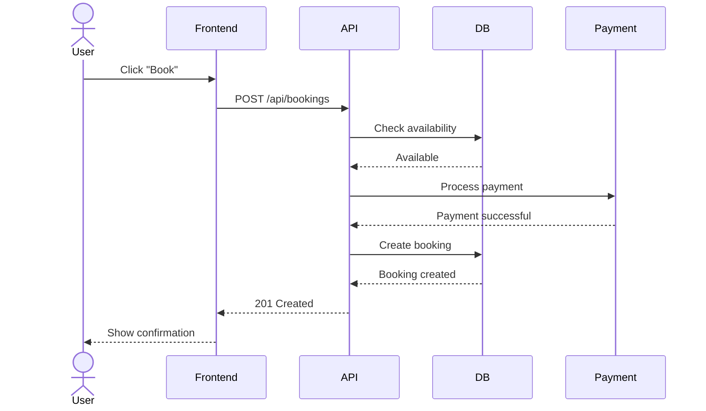

**Tipos de Participantes:**

- `actor` - Usuário humano
- `participant` - Sistema/Serviço
- `database` - Banco de dados

**Tipos de Seta:**

- `->` - Linha sólida (síncrona)
- `-->` - Linha pontilhada (resposta)
- `->>` - Seta sólida (mensagem assíncrona)
- `-->>` - Seta pontilhada (resposta assíncrona)

**Exemplo - Fluxo de Autenticação:**

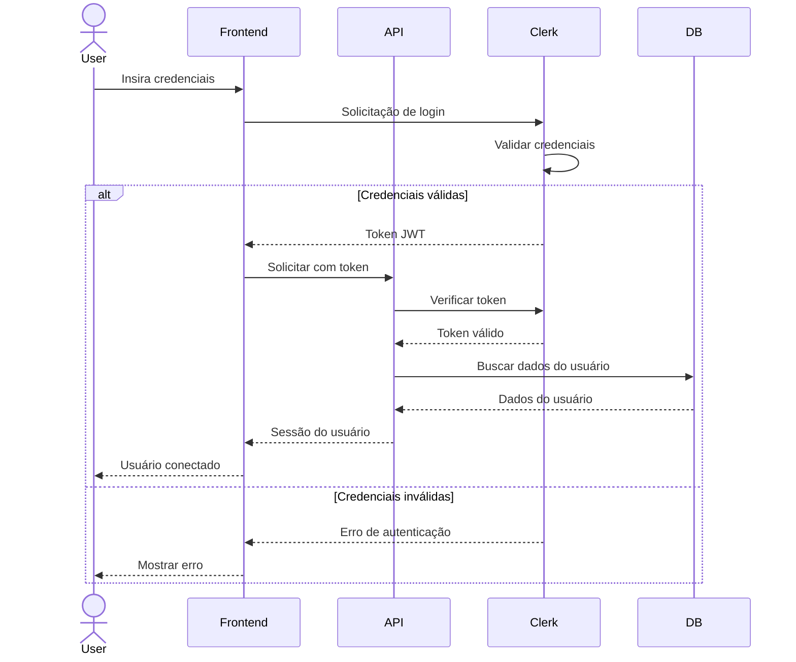

**Validação:**

- [ ] Todos os participantes identificados
- [ ] Fluxo de mensagens lógico
- [ ] Mensagens de retorno mostradas
- [ ] Blocos alt/loop usados corretamente

**Output**: Diagrama de sequência

### Etapa 4: Criação de DER

**Objetivo**: Documentar schema de banco de dados e relacionamentos

**Sintaxe:**

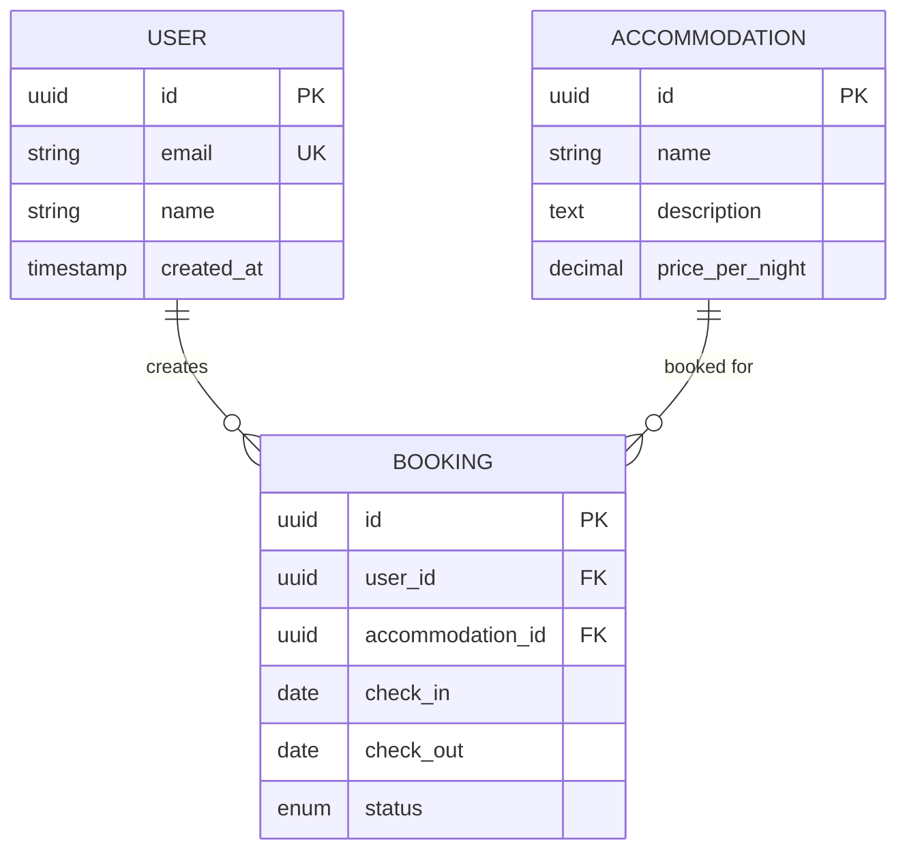

**Tipos de Relacionamento:**

- `||--||` - Um para um
- `||--o{` - Um para muitos
- `}o--o{` - Muitos para muitos
- `||--o|` - Um para zero ou um

**Símbolos de Cardinalidade:**

- `||` - Exatamente um
- `o|` - Zero ou um
- `}o` - Zero ou mais
- `}|` - Um ou mais

**Exemplo - DER Completo de Hospeda:**

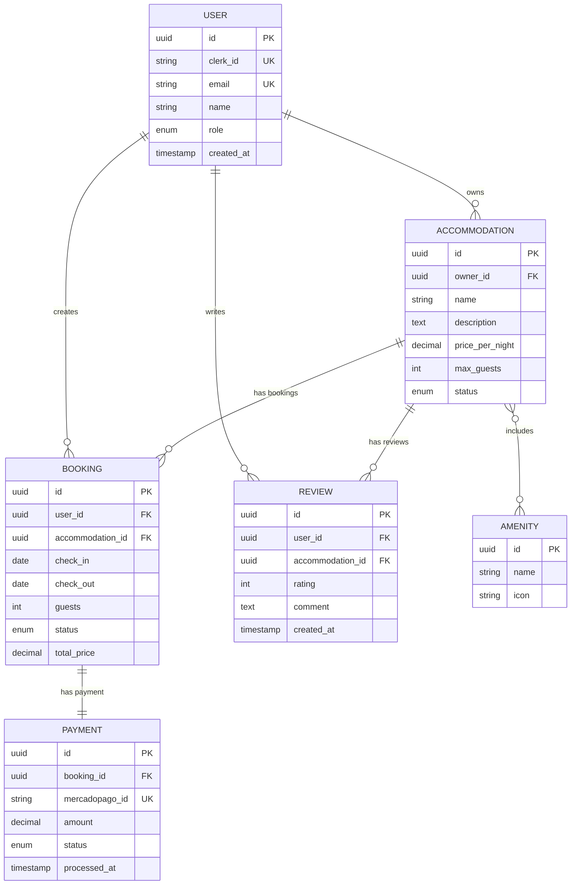

**Validação:**

- [ ] Todas as entidades definidas
- [ ] Relacionamentos precisos
- [ ] Cardinalidade correta
- [ ] Chaves primárias/estrangeiras marcadas

**Output**: Diagrama DER

### Etapa 5: Diagramas de Arquitetura C4

**Objetivo**: Documentar arquitetura de sistema em diferentes níveis

**Nível de Contexto** (Sistema no ambiente):

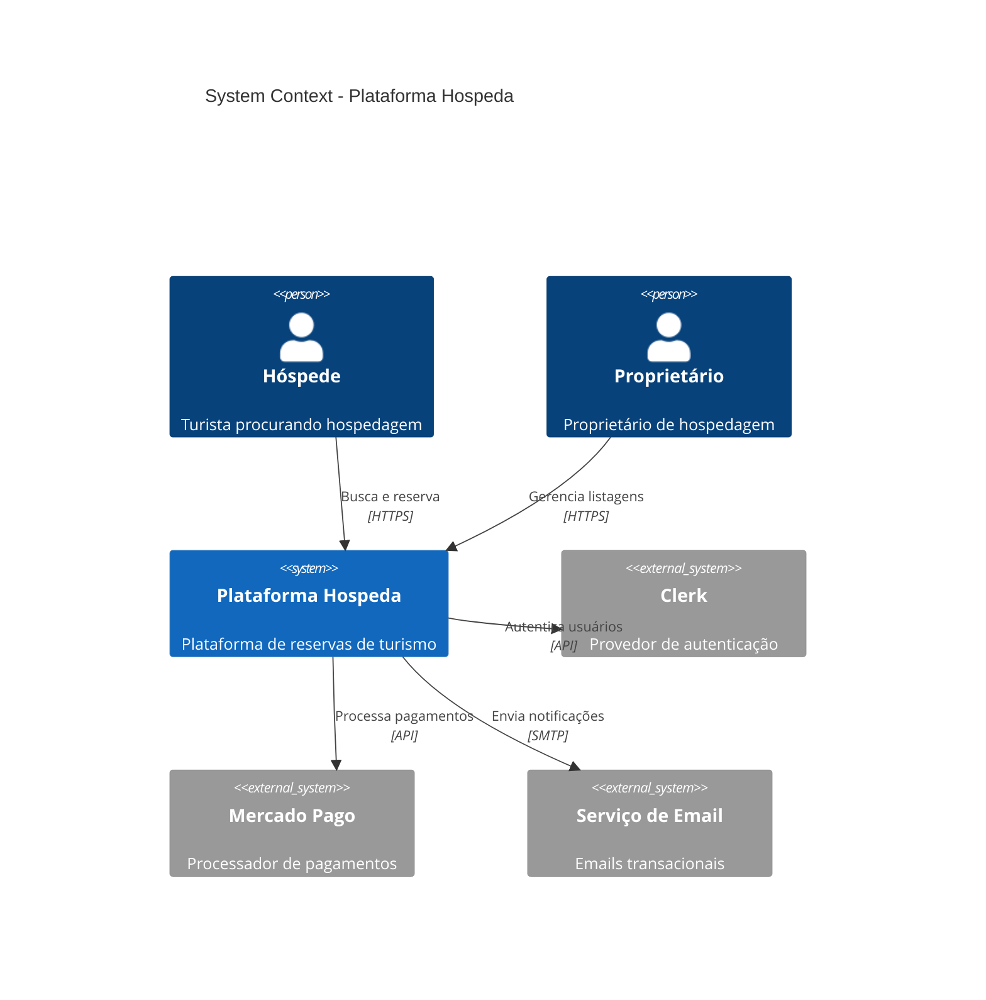

**Nível de Container** (Aplicações e armazenamentos de dados):

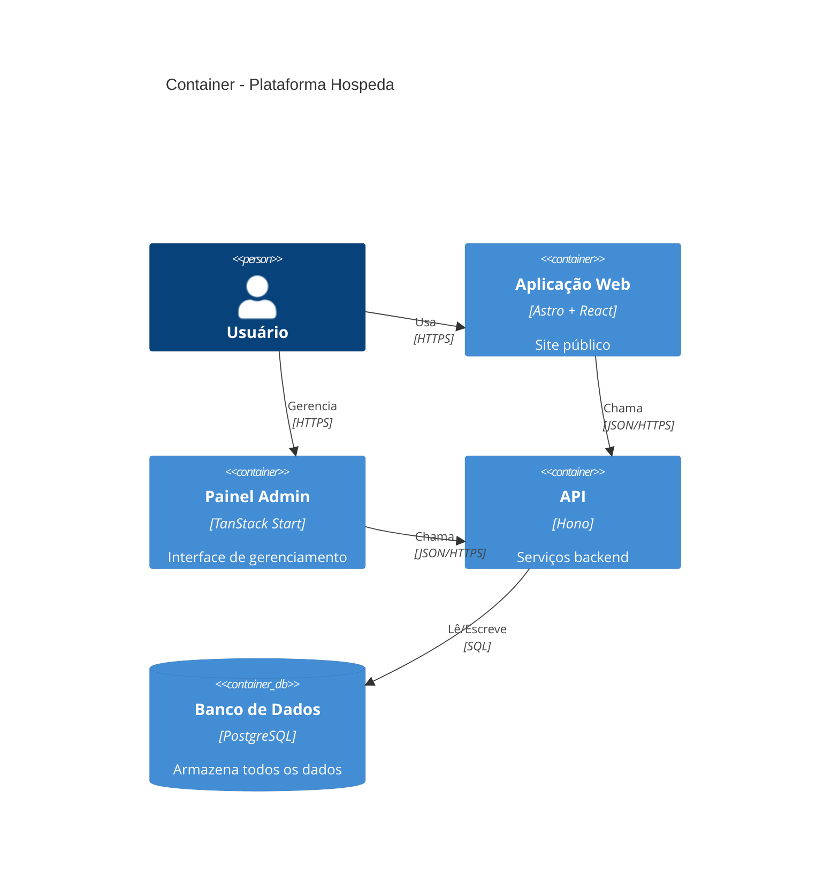

**Nível de Componente** (Estrutura interna):

```mermaid
C4Component
    title Components - Aplicação API

    Container(api, "API", "Hono")

    Component(routes, "Routes", "Hono Router", "Endpoints HTTP")
    Component(services, "Services", "Business Logic", "Operações de domínio")
    Component(models, "Models", "Data Access", "Operações de BD")
    Component(middleware, "Middleware", "Cross-cutting", "Autenticação, logging, erros")

    Rel(routes, middleware, "Usa")
    Rel(routes, services, "Chama")
    Rel(services, models, "Usa")
    Rel(models, db, "Consulta")
```

**Validação:**

- [ ] Nível apropriado selecionado
- [ ] Todos os sistemas/containers mostrados
- [ ] Relacionamentos claros
- [ ] Sistemas externos identificados

**Output**: Diagramas de arquitetura C4

### Etapa 6: Criação de Diagramas de Estado

**Objetivo**: Documentar máquinas de estado e ciclos de vida

**Sintaxe:**

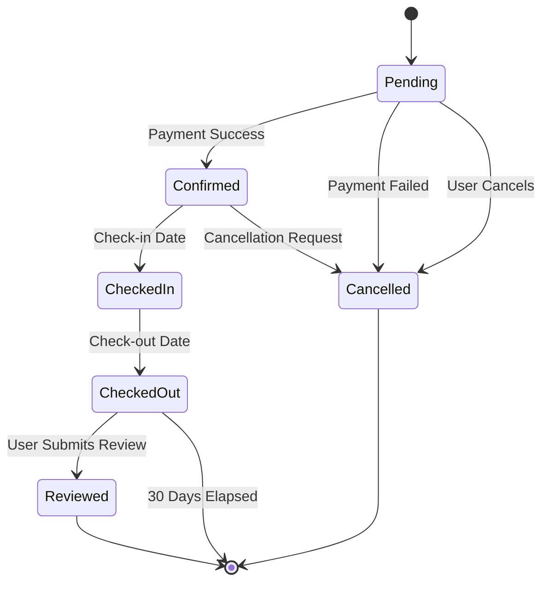

**Exemplo - Ciclo de Vida de Reserva:**

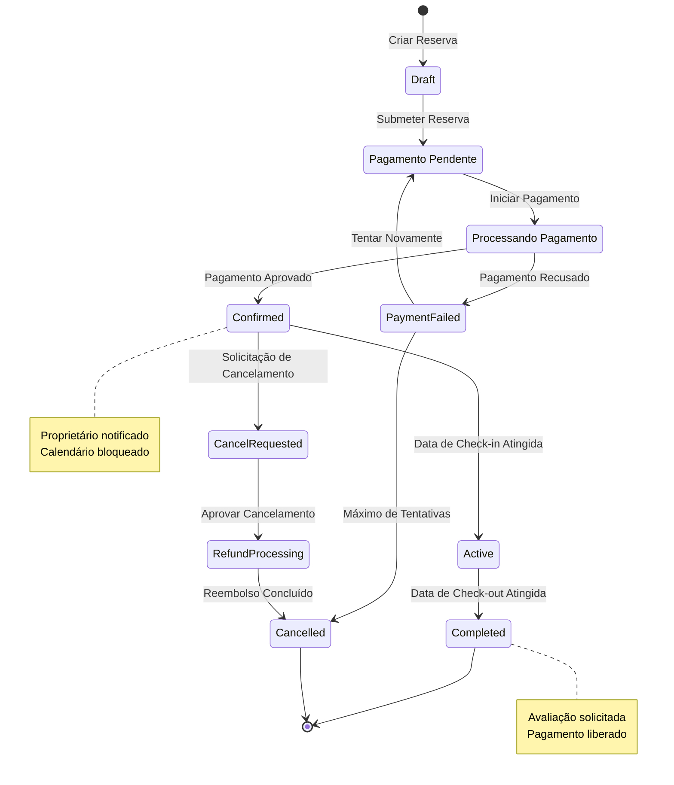

**Validação:**

- [ ] Todos os estados definidos
- [ ] Transições lógicas
- [ ] Estados inicial/final marcados
- [ ] Notas explicam estados-chave

**Output**: Diagrama de estado

### Etapa 7: Styling e Customização

**Objetivo**: Aplicar styling consistente aos diagramas

**Aplicação de Tema:**

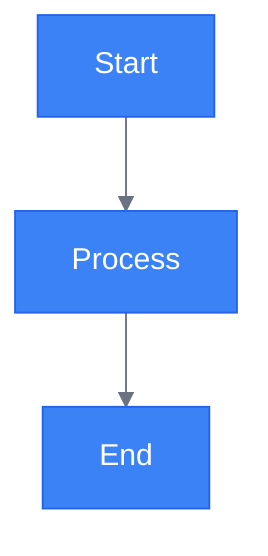

**Styling de Classes:**

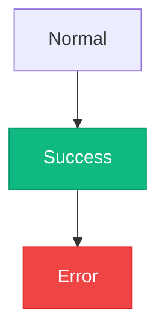

**Validação:**

- [ ] Cores correspondem à marca
- [ ] Contraste suficiente
- [ ] Styling consistente
- [ ] Legível em ambos os temas

**Output**: Diagramas com styling

## Output

**Produz:**

- Código de diagrama Mermaid em markdown
- Múltiplos tipos de diagrama conforme necessário
- Diagramas com styling e tema
- Visualizações prontas para documentação

**Critérios de Sucesso:**

- Diagrama representa com precisão o sistema
- Todos os elementos adequadamente rotulados
- Relacionamentos claros e corretos
- Styling consistente com marca
- Renderiza corretamente em markdown

## Melhores Práticas

1. **Simplicidade**: Manter diagramas focados e sem poluição visual
2. **Labels**: Rótulos claros e descritivos para todos os elementos
3. **Direção**: Direção de fluxo consistente (geralmente de cima para baixo ou esquerda para direita)
4. **Agrupamento**: Usar subgráficos para agrupar elementos relacionados
5. **Cores**: Usar cores para destacar elementos importantes
6. **Notas**: Adicionar notas para explicar lógica complexa
7. **Níveis**: Usar nível de abstração apropriado para a audiência
8. **Atualizações**: Manter diagramas sincronizados com código
9. **Comentários**: Adicionar comentários no código Mermaid para manutenibilidade
10. **Testes**: Verificar que diagramas renderizam na plataforma de destino

## Padrões Comuns

### Fluxo de Solicitação de API

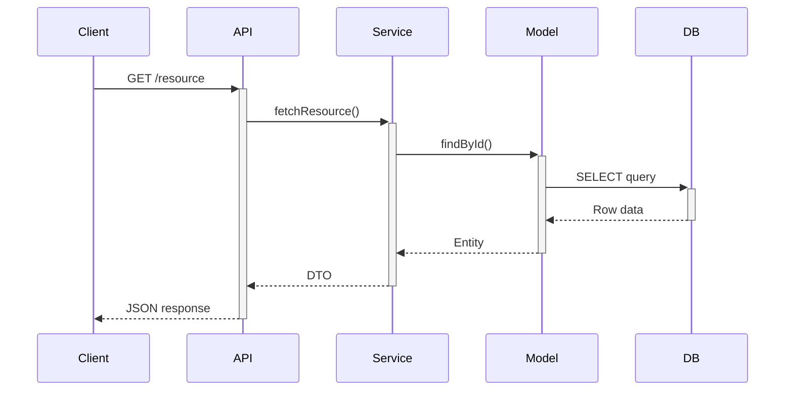

### Fluxo de Tratamento de Erro

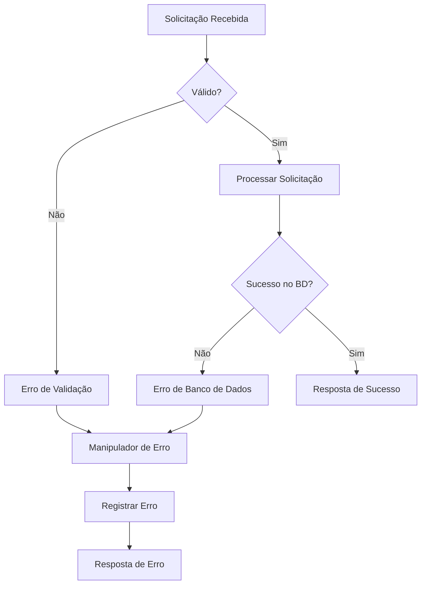

## Observações

- Mermaid renderiza no GitHub, GitLab, Notion e na maioria dos visualizadores de markdown
- Editor ao vivo disponível em mermaid.live
- Complexidade máxima: Manter abaixo de 20 nós para legibilidade
- Usar subgráficos para agrupar nós relacionados
- Testar renderização na plataforma de destino antes de commitar
- Manter fonte de diagrama em arquivos markdown, não em imagens
- Controlar versão de diagramas com código
- Atualizar diagramas durante revisão de código