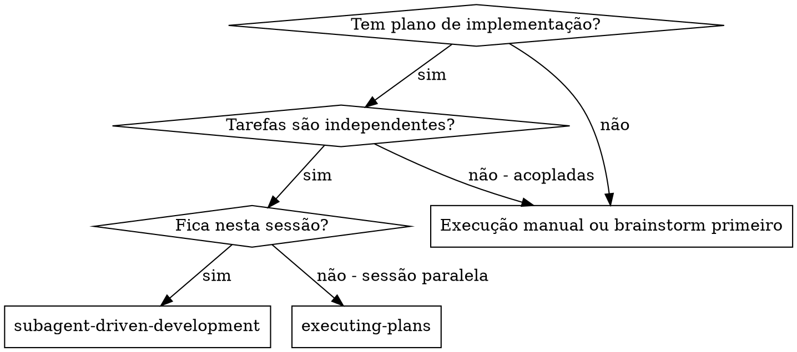
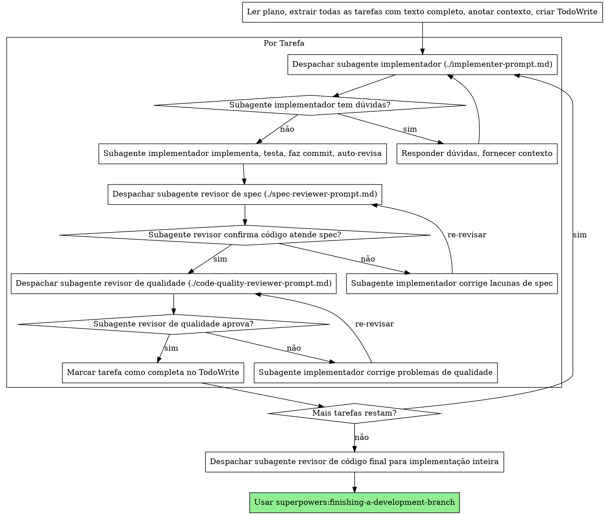

# Desenvolvimento Orientado por Subagentes

Execute o plano despachando um subagente fresco por tarefa, com revisão em dois estágios após cada uma: revisão de conformidade com especificação primeiro, depois revisão de qualidade de código.

**Princípio central:** Subagente fresco por tarefa + revisão em dois estágios (spec depois qualidade) = alta qualidade, iteração rápida

## Quando Usar



**vs. Executing Plans (sessão paralela):**
- Mesma sessão (sem troca de contexto)
- Subagente fresco por tarefa (sem poluição de contexto)
- Revisão em dois estágios após cada tarefa: conformidade com especificação primeiro, depois qualidade de código
- Iteração mais rápida (sem humano no loop entre tarefas)

## O Processo



## Templates de Prompt

- `./implementer-prompt.md` - Despachar subagente implementador
- `./spec-reviewer-prompt.md` - Despachar subagente revisor de conformidade com especificação
- `./code-quality-reviewer-prompt.md` - Despachar subagente revisor de qualidade de código

## Exemplo de Fluxo de Trabalho

```
Você: Estou usando Desenvolvimento Orientado por Subagentes para executar este plano.

[Ler arquivo de plano uma vez: docs/plans/feature-plan.md]
[Extrair todas as 5 tarefas com texto completo e contexto]
[Criar TodoWrite com todas as tarefas]

Tarefa 1: Script de instalação de hook

[Obter texto e contexto da Tarefa 1 (já extraído)]
[Despachar subagente de implementação com texto completo da tarefa + contexto]

Implementador: "Antes de começar - o hook deve ser instalado a nível de usuário ou sistema?"

Você: "Nível de usuário (~/.config/superpowers/hooks/)"

Implementador: "Entendi. Implementando agora..."
[Depois] Implementador:
  - Implementou comando install-hook
  - Adicionou testes, 5/5 passando
  - Auto-revisão: Descobriu que perdi flag --force, adicionei
  - Fez commit

[Despachar revisor de conformidade com spec]
Revisor de spec: ✅ Conforme com spec - todos os requisitos atendidos, nada extra

[Obter SHAs do git, despachar revisor de qualidade de código]
Revisor de código: Pontos fortes: Boa cobertura de testes, limpo. Problemas: Nenhum. Aprovado.

[Marcar Tarefa 1 como completa]

Tarefa 2: Modos de recuperação

[Obter texto e contexto da Tarefa 2 (já extraído)]
[Despachar subagente de implementação com texto completo da tarefa + contexto]

Implementador: [Sem dúvidas, prossegue]
Implementador:
  - Adicionou modos verify/repair
  - 8/8 testes passando
  - Auto-revisão: Tudo bem
  - Fez commit

[Despachar revisor de conformidade com spec]
Revisor de spec: ❌ Problemas:
  - Faltando: Relatório de progresso (spec diz "reportar a cada 100 itens")
  - Extra: Adicionou flag --json (não solicitado)

[Implementador corrige problemas]
Implementador: Removeu flag --json, adicionou relatório de progresso

[Revisor de spec revisa novamente]
Revisor de spec: ✅ Conforme com spec agora

[Despachar revisor de qualidade de código]
Revisor de código: Pontos fortes: Sólido. Problemas (Importante): Número mágico (100)

[Implementador corrige]
Implementador: Extraído constante PROGRESS_INTERVAL

[Revisor de código revisa novamente]
Revisor de código: ✅ Aprovado

[Marcar Tarefa 2 como completa]

...

[Depois de todas as tarefas]
[Despachar revisor de código final]
Revisor final: Todos os requisitos atendidos, pronto para merge

Pronto!
```

## Vantagens

**vs. Execução manual:**
- Subagentes seguem TDD naturalmente
- Contexto fresco por tarefa (sem confusão)
- Seguro para paralelização (subagentes não interferem)
- Subagente pode fazer perguntas (antes E durante o trabalho)

**vs. Executing Plans:**
- Mesma sessão (sem handoff)
- Progresso contínuo (sem espera)
- Pontos de revisão automáticos

**Ganhos de eficiência:**
- Sem overhead de leitura de arquivo (controlador fornece texto completo)
- Controlador cuida exatamente qual contexto é necessário
- Subagente obtém informação completa antecipadamente
- Perguntas surfaceadas antes do trabalho (não depois)

**Portões de qualidade:**
- Auto-revisão detecta problemas antes do handoff
- Revisão em dois estágios: conformidade com spec, depois qualidade de código
- Loops de revisão garantem que correções funcionam
- Conformidade com spec previne construção excessiva/insuficiente
- Qualidade de código garante que implementação é bem-construída

**Custo:**
- Mais invocações de subagente (implementador + 2 revisores por tarefa)
- Controlador faz mais trabalho de prep (extraindo todas as tarefas antecipadamente)
- Loops de revisão adicionam iterações
- Mas detecta problemas cedo (mais barato do que debugar depois)

## Red Flags

**Nunca:**
- Pule revisões (conformidade com spec OU qualidade de código)
- Prossiga com problemas não corrigidos
- Despache múltiplos subagentes de implementação em paralelo (conflitos)
- Faça subagente ler arquivo de plano (forneça texto completo em vez disso)
- Pule contexto de cenário (subagente precisa entender onde tarefa se encaixa)
- Ignore dúvidas de subagente (responda antes de deixá-lo prosseguir)
- Aceite "próximo o suficiente" em conformidade com spec (revisor de spec encontrou problemas = não feito)
- Pule loops de revisão (revisor encontrou problemas = implementador corrige = revisa novamente)
- Deixe auto-revisão de implementador substituir revisão real (ambas são necessárias)
- **Inicie revisão de qualidade de código antes de conformidade com spec estar ✅** (ordem errada)
- Mude para próxima tarefa enquanto qualquer revisão tiver problemas abertos

**Se subagente fizer perguntas:**
- Responda clara e completamente
- Forneça contexto adicional se necessário
- Não o apresse para implementação

**Se revisor encontrar problemas:**
- Implementador (mesmo subagente) corrige
- Revisor revisa novamente
- Repita até aprovação
- Não pule a re-revisão

**Se subagente falhar tarefa:**
- Despache subagente de correção com instruções específicas
- Não tente corrigir manualmente (poluição de contexto)

## Integração

**Habilidades de fluxo de trabalho obrigatórias:**
- **superpowers:writing-plans** - Cria o plano que esta habilidade executa
- **superpowers:requesting-code-review** - Template de revisão de código para subagentes revisores
- **superpowers:finishing-a-development-branch** - Completa desenvolvimento após todas as tarefas

**Subagentes devem usar:**
- **superpowers:test-driven-development** - Subagentes seguem TDD para cada tarefa

**Fluxo de trabalho alternativo:**
- **superpowers:executing-plans** - Use para sessão paralela em vez de execução na mesma sessão