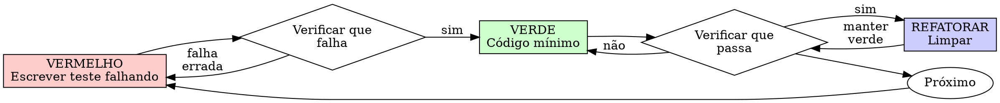

# Desenvolvimento Orientado por Testes (TDD)

## Visão Geral

Escreva o teste primeiro. Veja-o falhar. Escreva o código mínimo para passar.

**Princípio central:** Se você não viu o teste falhar, não sabe se ele testa a coisa certa.

**Violar a letra das regras é violar o espírito das regras.**

## Quando Usar

**Sempre:**
- Novas features
- Correções de bugs
- Refatoração
- Mudanças de comportamento

**Exceções (converse com seu parceiro):**
- Protótipos descartáveis
- Código gerado
- Arquivos de configuração

Pensando "pular TDD só desta vez"? Pare. Isso é racionalização.

## A Lei de Ferro

```
NENHUM CÓDIGO DE PRODUÇÃO SEM UM TESTE FALHANDO PRIMEIRO
```

Escrever código antes do teste? Delete-o. Comece de novo.

**Sem exceções:**
- Não o mantenha como "referência"
- Não "adapte" enquanto escreve testes
- Não o veja
- Delete significa delete

Implemente do zero a partir dos testes. Ponto final.

## Vermelho-Verde-Refatoração



### VERMELHO - Escrever Teste Falhando

Escreva um teste mínimo mostrando o que deveria acontecer.

<Good>
```typescript
test('retries failed operations 3 times', async () => {
  let attempts = 0;
  const operation = () => {
    attempts++;
    if (attempts < 3) throw new Error('fail');
    return 'success';
  };

  const result = await retryOperation(operation);

  expect(result).toBe('success');
  expect(attempts).toBe(3);
});
```
Nome claro, testa comportamento real, uma única coisa
</Good>

<Bad>
```typescript
test('retry works', async () => {
  const mock = jest.fn()
    .mockRejectedValueOnce(new Error())
    .mockRejectedValueOnce(new Error())
    .mockResolvedValueOnce('success');
  await retryOperation(mock);
  expect(mock).toHaveBeenCalledTimes(3);
});
```
Nome vago, testa mock não o código
</Bad>

**Requisitos:**
- Um comportamento
- Nome claro
- Código real (mocks somente se inevitável)

### Verificar VERMELHO - Veja-o Falhar

**OBRIGATÓRIO. Nunca pule.**

```bash
npm test path/to/test.test.ts
```

Confirme:
- Teste falha (não erro)
- Mensagem de falha é esperada
- Falha porque feature ausente (não typos)

**Teste passa?** Você está testando comportamento existente. Corrija o teste.

**Teste com erro?** Corrija o erro, re-execute até que falhe corretamente.

### VERDE - Código Mínimo

Escreva o código mais simples para passar no teste.

<Good>
```typescript
async function retryOperation<T>(fn: () => Promise<T>): Promise<T> {
  for (let i = 0; i < 3; i++) {
    try {
      return await fn();
    } catch (e) {
      if (i === 2) throw e;
    }
  }
  throw new Error('unreachable');
}
```
Apenas o suficiente para passar
</Good>

<Bad>
```typescript
async function retryOperation<T>(
  fn: () => Promise<T>,
  options?: {
    maxRetries?: number;
    backoff?: 'linear' | 'exponential';
    onRetry?: (attempt: number) => void;
  }
): Promise<T> {
  // YAGNI
}
```
Over-engineered
</Bad>

Não adicione features, não refatore outro código, não "melhore" além do teste.

### Verificar VERDE - Veja-o Passar

**OBRIGATÓRIO.**

```bash
npm test path/to/test.test.ts
```

Confirme:
- Teste passa
- Outros testes ainda passam
- Saída impecável (sem erros, avisos)

**Teste falha?** Corrija código, não o teste.

**Outros testes falham?** Corrija agora.

### REFATORAR - Limpar

Apenas após verde:
- Remova duplicação
- Melhore nomes
- Extraia helpers

Mantenha testes verdes. Não adicione comportamento.

### Repetir

Próximo teste falhando para próxima feature.

## Bons Testes

| Qualidade | Bom | Ruim |
|-----------|-----|------|
| **Mínimo** | Uma coisa. "e" no nome? Divida. | `test('validates email and domain and whitespace')` |
| **Claro** | Nome descreve comportamento | `test('test1')` |
| **Mostra intenção** | Demonstra API desejada | Obscurece o que código deveria fazer |

## Por Que a Ordem Importa

**"Vou escrever testes depois para verificar que funciona"**

Testes escritos após código passam imediatamente. Passar imediatamente não prova nada:
- Pode estar testando coisa errada
- Pode estar testando implementação, não comportamento
- Pode estar perdendo casos extremos que você esqueceu
- Você nunca viu ele detectar o bug

Teste-primeiro força você a ver o teste falhar, provando que ele realmente testa algo.

**"Já testei manualmente todos os casos extremos"**

Testes manuais são ad-hoc. Você acha que testou tudo mas:
- Sem registro do que testou
- Não pode re-executar quando código muda
- Fácil esquecer casos sob pressão
- "Funcionou quando tentei" ≠ abrangente

Testes automatizados são sistemáticos. Executam da mesma forma toda vez.

**"Deletar X horas de trabalho é desperdício"**

Falácia do custo irrecuperável. O tempo já se foi. Sua escolha agora:
- Deletar e reescrever com TDD (mais X horas, alta confiança)
- Manter e adicionar testes depois (30 min, baixa confiança, prováveis bugs)

O "desperdício" é manter código que você não pode confiar. Código funcionando sem testes reais é débito técnico.

**"TDD é dogmático, ser pragmático significa se adaptar"**

TDD É pragmático:
- Encontra bugs antes do commit (mais rápido que debugar depois)
- Previne regressions (testes detectam quebras imediatamente)
- Documenta comportamento (testes mostram como usar código)
- Habilita refatoração (mude livremente, testes detectam quebras)

Atalhos "pragmáticos" = debug em produção = mais lento.

**"Testes depois alcançam os mesmos objetivos - é espírito não ritual"**

Não. Testes-depois respondem "O que isso faz?" Testes-primeiro respondem "O que isso deveria fazer?"

Testes-depois são enviesados pela sua implementação. Você testa o que construiu, não o que é requerido. Você verifica casos extremos lembrados, não descobertos.

Testes-primeiro forçam descoberta de casos extremos antes de implementar. Testes-depois verificam que você lembrou de tudo (você não lembrou).

30 minutos de testes depois ≠ TDD. Você consegue cobertura, perde prova de que testes funcionam.

## Racionalizações Comuns

| Desculpa | Realidade |
|----------|-----------|
| "Simples demais para testar" | Código simples quebra. Teste leva 30 segundos. |
| "Vou testar depois" | Testes passando imediatamente não provam nada. |
| "Testes depois alcançam os mesmos objetivos" | Testes-depois = "o que isso faz?" Testes-primeiro = "o que isso deveria fazer?" |
| "Já testei manualmente" | Ad-hoc ≠ sistemático. Sem registro, não pode re-executar. |
| "Deletar X horas é desperdício" | Falácia do custo irrecuperável. Manter código não verificado é débito técnico. |
| "Manter como referência, escrever testes primeiro" | Você vai adaptar. Isso é testar depois. Delete significa delete. |
| "Preciso explorar primeiro" | Tudo bem. Jogue exploração fora, comece com TDD. |
| "Teste difícil = design pouco claro" | Escute o teste. Difícil de testar = difícil de usar. |
| "TDD vai me deixar mais lento" | TDD é mais rápido que debugar. Pragmático = testes-primeiro. |
| "Teste manual é mais rápido" | Manual não prova casos extremos. Você vai re-testar toda mudança. |
| "Código existente não tem testes" | Você está melhorando. Adicione testes para código existente. |

## Red Flags - PARE e Comece de Novo

- Código antes do teste
- Teste após implementação
- Teste passa imediatamente
- Não consegue explicar por que teste falhou
- Testes adicionados "depois"
- Racionalizando "só desta vez"
- "Já testei manualmente"
- "Testes depois alcançam o mesmo propósito"
- "É sobre espírito não ritual"
- "Manter como referência" ou "adaptar código existente"
- "Já gastei X horas, deletar é desperdício"
- "TDD é dogmático, estou sendo pragmático"
- "Isso é diferente porque..."

**Todos estes significam: Delete código. Comece de novo com TDD.**

## Exemplo: Correção de Bug

**Bug:** Email vazio aceito

**VERMELHO**
```typescript
test('rejects empty email', async () => {
  const result = await submitForm({ email: '' });
  expect(result.error).toBe('Email required');
});
```

**Verificar VERMELHO**
```bash
$ npm test
FAIL: expected 'Email required', got undefined
```

**VERDE**
```typescript
function submitForm(data: FormData) {
  if (!data.email?.trim()) {
    return { error: 'Email required' };
  }
  // ...
}
```

**Verificar VERDE**
```bash
$ npm test
PASS
```

**REFATORAR**
Extraia validação para múltiplos campos se necessário.

## Checklist de Verificação

Antes de marcar trabalho como completo:

- [ ] Toda nova função/método tem um teste
- [ ] Viu cada teste falhar antes de implementar
- [ ] Cada teste falhou pela razão esperada (feature faltando, não typo)
- [ ] Escreveu código mínimo para passar cada teste
- [ ] Todos os testes passam
- [ ] Saída impecável (sem erros, avisos)
- [ ] Testes usam código real (mocks somente se inevitável)
- [ ] Casos extremos e erros cobertos

Não consegue marcar todas? Você pulou TDD. Comece de novo.

## Quando Travado

| Problema | Solução |
|----------|---------|
| Não sabe como testar | Escreva API desejada. Escreva assertion primeiro. Converse com seu parceiro. |
| Teste muito complicado | Design muito complicado. Simplifique interface. |
| Deve mockar tudo | Código muito acoplado. Use dependency injection. |
| Setup de teste enorme | Extraia helpers. Ainda complexo? Simplifique design. |

## Integração com Debug

Bug encontrado? Escreva teste falhando reproduzindo-o. Siga ciclo TDD. Teste prova fix e previne regressão.

Nunca corrija bugs sem um teste.

## Anti-Patterns de Teste

Ao adicionar mocks ou test utilities, leia @testing-anti-patterns.md para evitar armadilhas comuns:
- Testar comportamento mock em vez de comportamento real
- Adicionar métodos só-para-teste a classes de produção
- Mockar sem entender dependências

## Regra Final

```
Código de produção → teste existe e falhou primeiro
Caso contrário → não é TDD
```

Sem exceções sem permissão do seu parceiro.