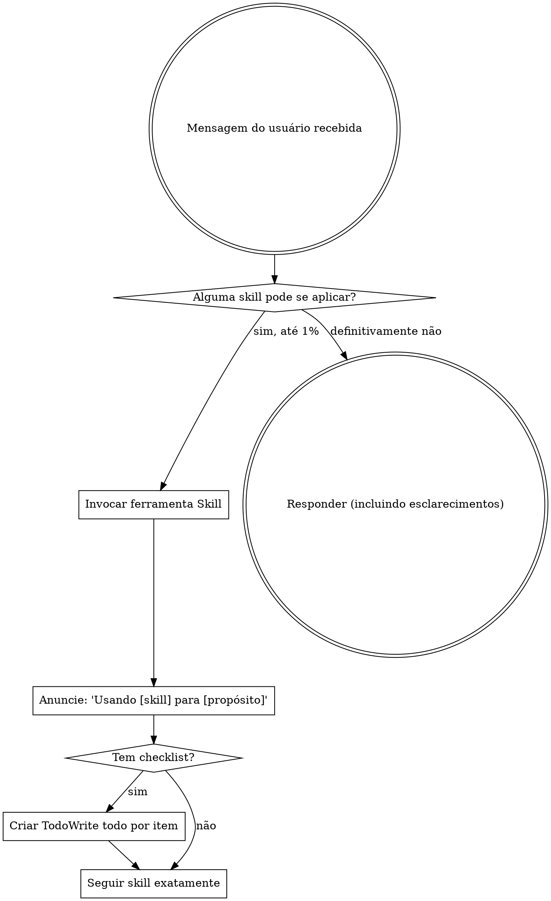

<EXTREMELY-IMPORTANT>
Se você acha que há até 1% de chance de uma skill se aplicar ao que você está fazendo, você ABSOLUTAMENTE DEVE ler a skill.

SE UMA SKILL SE APLICA À SUA TAREFA, VOCÊ NÃO TEM ESCOLHA. VOCÊ DEVE USÁ-LA.

Isso é inegociável. Isso é obrigatório. Você não pode se racionalizar para sair disso.
</EXTREMELY-IMPORTANT>

# Usando Skills

## A Regra

**Verifique skills ANTES DE QUALQUER RESPOSTA.** Isso inclui perguntas de esclarecimento. Até 1% de chance significa invocar a ferramenta Skill primeiro.

## Sinais de Alerta

Estes pensamentos significam PARE—você está se racionalizando:

| Pensamento | Realidade |
|---------|---------|
| "Esta é apenas uma pergunta simples" | Perguntas são tarefas. Verifique skills. |
| "Preciso de mais contexto primeiro" | Verificação de skill vem ANTES de perguntas de esclarecimento. |
| "Deixe-me explorar o codebase primeiro" | Skills dizem COMO explorar. Verifique primeiro. |
| "Posso verificar git/arquivos rapidamente" | Arquivos carecem de contexto de conversa. Verifique skills. |
| "Deixe-me coletar informações primeiro" | Skills dizem COMO coletar informações. |
| "Isso não precisa de uma skill formal" | Se uma skill existe, use-a. |
| "Eu lembro desta skill" | Skills evoluem. Leia a versão atual. |
| "Isso não conta como uma tarefa" | Ação = tarefa. Verifique skills. |
| "A skill é exagerada" | Coisas simples se tornam complexas. Use-a. |
| "Vou apenas fazer uma coisa primeiro" | Verifique ANTES de fazer qualquer coisa. |
| "Isso parece produtivo" | Ação indisciplinada desperdiça tempo. Skills previnem isso. |

## Prioridade de Skills

Quando múltiplas skills poderiam se aplicar, use esta ordem:

1. **Skills de processo primeiro** (brainstorming, debugging) - essas determinam COMO abordar a tarefa
2. **Skills de implementação segundo** (frontend-design, mcp-builder) - essas guiam a execução

"Vamos construir X" → brainstorming primeiro, depois skills de implementação.
"Corrija este bug" → debugging primeiro, depois skills específicas do domínio.

## Tipos de Skill

**Rígidas** (TDD, debugging): Siga exatamente. Não abandone a disciplina.

**Flexíveis** (padrões): Adapte princípios ao contexto.

A skill em si diz qual é qual.

## Instruções do Usuário

Instruções dizem O QUÊ, não COMO. "Adicione X" ou "Corrija Y" não significa pular workflows.