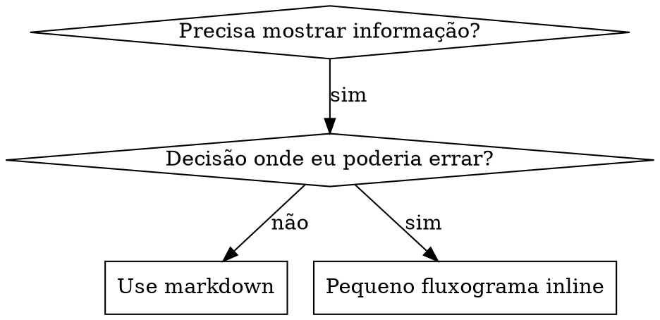

# Escrevendo Skills

## Visão Geral

**Escrever skills É Test-Driven Development aplicado à documentação de processos.**

**Skills pessoais vivem em diretórios específicos do agente (`~/.claude/skills` para Claude Code, `~/.codex/skills` para Codex)**

Você escreve casos de teste (cenários de pressão com subagentes), observa falhas (comportamento base), escreve a skill (documentação), observa testes passarem (agentes obedecem), e refatora (fecha brechas).

**Princípio fundamental:** Se você não viu um agente falhar sem a skill, você não sabe se a skill ensina a coisa certa.

**CONHECIMENTO OBRIGATÓRIO:** Você DEVE entender superpowers:test-driven-development antes de usar esta skill. Essa skill define o ciclo fundamental RED-GREEN-REFACTOR. Esta skill adapta TDD para documentação.

**Orientação oficial:** Para as melhores práticas oficiais de autoria de skills da Anthropic, veja anthropic-best-practices.md. Este documento fornece padrões e diretrizes adicionais que complementam a abordagem focada em TDD nesta skill.

## O que é uma Skill?

Uma **skill** é um guia de referência para técnicas comprovadas, padrões ou ferramentas. Skills ajudam instâncias futuras do Claude a encontrar e aplicar abordagens eficazes.

**Skills são:** Técnicas reutilizáveis, padrões, ferramentas, guias de referência

**Skills NÃO são:** Narrativas sobre como você resolveu um problema uma vez

## Mapeamento de TDD para Skills

| Conceito TDD | Criação de Skill |
|-------------|----------------|
| **Caso de teste** | Cenário de pressão com subagente |
| **Código de produção** | Documento skill (SKILL.md) |
| **Teste falha (RED)** | Agente viola regra sem skill (linha base) |
| **Teste passa (GREEN)** | Agente obedece com skill presente |
| **Refactor** | Fecha brechas mantendo conformidade |
| **Escrever teste primeiro** | Execute cenário de linha base ANTES de escrever skill |
| **Observar falha** | Documente racionalizações exatas que o agente usa |
| **Código mínimo** | Escreva skill endereçando essas violações específicas |
| **Observar passar** | Verifique que agente agora obedece |
| **Ciclo refactor** | Encontre novas racionalizações → tape → re-verifique |

Todo o processo de criação de skill segue RED-GREEN-REFACTOR.

## Quando Criar uma Skill

**Crie quando:**
- Técnica não era intuitivamente óbvia para você
- Você consultaria isso novamente em projetos
- Padrão se aplica amplamente (não específico de projeto)
- Outros se beneficiariam

**Não crie para:**
- Soluções únicas
- Práticas padrão bem documentadas em outro lugar
- Convenções específicas de projeto (coloque em CLAUDE.md)

## Tipos de Skill

### Técnica
Método concreto com passos a seguir (condition-based-waiting, root-cause-tracing)

### Padrão
Forma de pensar sobre problemas (flatten-with-flags, test-invariants)

### Referência
Documentos de API, guias de sintaxe, documentação de ferramentas (office docs)

## Estrutura de Diretório

```
skills/
  skill-name/
    SKILL.md              # Referência principal (obrigatório)
    supporting-file.*     # Apenas se necessário
```

**Namespace plano** - todas as skills em um namespace pesquisável único

**Arquivos separados para:**
1. **Referência pesada** (100+ linhas) - documentos de API, sintaxe abrangente
2. **Ferramentas reutilizáveis** - Scripts, utilitários, templates

**Mantenha inline:**
- Princípios e conceitos
- Padrões de código (< 50 linhas)
- Tudo mais

## Estrutura SKILL.md

**Frontmatter (YAML):**
- Apenas dois campos suportados: `name` e `description`
- Máximo 1024 caracteres no total
- `name`: Use apenas letras, números e hífens (sem parênteses, caracteres especiais)
- `description`: Terceira pessoa, descreve APENAS quando usar (NÃO o que faz)
  - Comece com "Use quando..." para focar em condições de disparo
  - Inclua sintomas, situações e contextos específicos
  - **NUNCA resuma o processo ou workflow da skill** (veja seção CSO para entender por quê)
  - Mantenha abaixo de 500 caracteres se possível

```markdown
---
name: Skill-Name-With-Hyphens
description: Use quando [condições específicas de disparo e sintomas]
---

# Nome da Skill

## Visão Geral
O que é isso? Princípio fundamental em 1-2 frases.

## Quando Usar
[Pequeno fluxograma inline SE decisão não óbvia]

Lista com SINTOMAS e casos de uso
Quando NÃO usar

## Padrão Principal (para técnicas/padrões)
Comparação antes/depois de código

## Referência Rápida
Tabela ou bullets para escanear operações comuns

## Implementação
Código inline para padrões simples
Link para arquivo para referência pesada ou ferramentas reutilizáveis

## Erros Comuns
O que dá errado + correções

## Impacto no Mundo Real (opcional)
Resultados concretos
```


## Otimização de Busca do Claude (CSO)

**Crítico para descoberta:** Claude futuro PRECISA ENCONTRAR sua skill

### 1. Campo Description Rico

**Propósito:** Claude lê description para decidir quais skills carregar para uma tarefa dada. Faça responder: "Devo ler essa skill agora?"

**Formato:** Comece com "Use quando..." para focar em condições de disparo

**CRÍTICO: Description = Quando Usar, NÃO O Que a Skill Faz**

A description deve APENAS descrever condições de disparo. NÃO resuma o processo ou workflow da skill na description.

**Por que importa:** Testes revelaram que quando uma description resume o workflow da skill, Claude pode seguir a description em vez de ler o conteúdo completo da skill. Uma description dizendo "code review entre tarefas" fez Claude fazer UMA revisão, mesmo que o fluxograma da skill mostrasse claramente DUAS revisões (conformidade de spec depois qualidade de código).

Quando a description foi mudada para apenas "Use ao executar planos de implementação com tarefas independentes" (sem resumo de workflow), Claude leu corretamente o fluxograma e seguiu o processo de duas etapas.

**A armadilha:** Descriptions que resumem workflow criam um atalho que Claude vai seguir. O corpo da skill fica como documentação que Claude pula.

```yaml
# ❌ RUIM: Resume workflow - Claude pode seguir isso em vez de ler skill
description: Use ao executar planos - dispara subagente por tarefa com code review entre tarefas

# ❌ RUIM: Detalhes demais de processo
description: Use para TDD - escreva teste primeiro, observe falha, escreva código mínimo, refatore

# ✅ BOM: Apenas condições de disparo, sem resumo de workflow
description: Use ao executar planos de implementação com tarefas independentes na sessão atual

# ✅ BOM: Apenas condições de disparo
description: Use ao implementar qualquer feature ou bugfix, antes de escrever código de implementação
```

**Conteúdo:**
- Use gatilhos concretos, sintomas e situações que sinalizam quando esta skill aplica
- Descreva o *problema* (race conditions, comportamento inconsistente) não *sintomas específicos de linguagem* (setTimeout, sleep)
- Mantenha gatilhos agnósticos de tecnologia a menos que a própria skill seja específica de tecnologia
- Se skill é específica de tecnologia, deixe explícito no gatilho
- Escreva em terceira pessoa (injetado no system prompt)
- **NUNCA resuma o processo ou workflow da skill**

```yaml
# ❌ RUIM: Muito abstrato, vago, não inclui quando usar
description: Para testes async

# ❌ RUIM: Primeira pessoa
description: Posso ajudá-lo com testes async quando são flaky

# ❌ RUIM: Menciona tecnologia mas skill não é específica a ela
description: Use quando testes usam setTimeout/sleep e são flaky

# ✅ BOM: Começa com "Use quando", descreve problema, sem workflow
description: Use quando testes têm race conditions, dependências de timing ou passam/falham inconsistentemente

# ✅ BOM: Skill específica de tecnologia com gatilho explícito
description: Use ao usar React Router e lidar com redirects de autenticação
```

### 2. Cobertura de Palavras-Chave

Use palavras que Claude procuraria:
- Mensagens de erro: "Hook timed out", "ENOTEMPTY", "race condition"
- Sintomas: "flaky", "hanging", "zombie", "pollution"
- Sinônimos: "timeout/hang/freeze", "cleanup/teardown/afterEach"
- Ferramentas: Comandos reais, nomes de biblioteca, tipos de arquivo

### 3. Nomeação Descritiva

**Use voz ativa, verbo primeiro:**
- ✅ `creating-skills` não `skill-creation`
- ✅ `condition-based-waiting` não `async-test-helpers`

### 4. Eficiência de Token (Crítica)

**Problema:** skills getting-started e frequentemente-referenciadas carregam em TODA conversa. Cada token conta.

**Contagens de palavra alvo:**
- workflows getting-started: <150 palavras cada
- Skills frequentemente-carregadas: <200 palavras no total
- Outras skills: <500 palavras (ainda seja conciso)

**Técnicas:**

**Mova detalhes para help da ferramenta:**
```bash
# ❌ RUIM: Documente todos flags em SKILL.md
search-conversations suporta --text, --both, --after DATE, --before DATE, --limit N

# ✅ BOM: Referencie --help
search-conversations suporta múltiplos modos e filtros. Execute --help para detalhes.
```

**Use referências cruzadas:**
```markdown
# ❌ RUIM: Repita detalhes de workflow
Ao buscar, dispare subagente com template...
[20 linhas de instruções repetidas]

# ✅ BOM: Referencie outra skill
Sempre use subagentes (economia de contexto 50-100x). OBRIGATÓRIO: Use [outro-skill-name] para workflow.
```

**Comprima exemplos:**
```markdown
# ❌ RUIM: Exemplo verboso (42 palavras)
seu parceiro humano: "Como lidamos com erros de autenticação em React Router antes?"
Você: Vou buscar conversas passadas para padrões de autenticação React Router.
[Dispare subagente com consulta de busca: "React Router autenticação tratamento de erro 401"]

# ✅ BOM: Exemplo mínimo (20 palavras)
Parceiro: "Como lidamos com erros de auth em React Router?"
Você: Buscando...
[Dispare subagente → síntese]
```

**Elimine redundância:**
- Não repita o que está em skills referenciadas
- Não explique o que é óbvio do comando
- Não inclua múltiplos exemplos do mesmo padrão

**Verificação:**
```bash
wc -w skills/path/SKILL.md
# workflows getting-started: aponte para <150 cada
# Outros frequentemente-carregados: aponte para <200 no total
```

**Nomeie pelo que você FAZ ou insight principal:**
- ✅ `condition-based-waiting` > `async-test-helpers`
- ✅ `using-skills` não `skill-usage`
- ✅ `flatten-with-flags` > `data-structure-refactoring`
- ✅ `root-cause-tracing` > `debugging-techniques`

**Gerúndios (-ing) funcionam bem para processos:**
- `creating-skills`, `testing-skills`, `debugging-with-logs`
- Ativo, descreve a ação que você está fazendo

### 4. Referência Cruzada de Outras Skills

**Ao escrever documentação que referencia outras skills:**

Use apenas nome da skill, com marcadores de requisito explícito:
- ✅ Bom: `**SUB-SKILL OBRIGATÓRIA:** Use superpowers:test-driven-development`
- ✅ Bom: `**CONHECIMENTO OBRIGATÓRIO:** Você DEVE entender superpowers:systematic-debugging`
- ❌ Ruim: `Ver skills/testing/test-driven-development` (pouco claro se obrigatório)
- ❌ Ruim: `@skills/testing/test-driven-development/SKILL.md` (carrega à força, queima contexto)

**Por que sem links @:** A sintaxe `@` carrega arquivos imediatamente, consumindo 200k+ contexto antes de você precisar.

## Uso de Fluxograma



**Use fluxogramas APENAS para:**
- Pontos de decisão não óbvios
- Loops de processo onde você poderia parar cedo
- Decisões "Use A vs B"

**Nunca use fluxogramas para:**
- Material de referência → Tabelas, listas
- Exemplos de código → Blocos markdown
- Instruções lineares → Listas numeradas
- Labels sem significado semântico (step1, helper2)

Veja @graphviz-conventions.dot para regras de estilo graphviz.

**Visualizando para seu parceiro humano:** Use `render-graphs.js` neste diretório para renderizar fluxogramas da skill para SVG:
```bash
./render-graphs.js ../some-skill           # Cada diagrama separadamente
./render-graphs.js ../some-skill --combine # Todos diagramas em um SVG
```

## Exemplos de Código

**Um excelente exemplo supera muitos medíocres**

Escolha linguagem mais relevante:
- Técnicas de teste → TypeScript/JavaScript
- Debug de sistema → Shell/Python
- Processamento de dados → Python

**Bom exemplo:**
- Completo e executável
- Bem comentado explicando POR QUÊ
- De cenário real
- Mostra padrão claramente
- Pronto para adaptar (não template genérico)

**Não:**
- Implemente em 5+ linguagens
- Crie templates com-a-preencher
- Escreva exemplos contritos

Você é bom em portar - um ótimo exemplo é suficiente.

## Organização de Arquivo

### Skill Autossuficiente
```
defense-in-depth/
  SKILL.md    # Tudo inline
```
Quando: Todo conteúdo cabe, nenhuma referência pesada necessária

### Skill com Ferramenta Reutilizável
```
condition-based-waiting/
  SKILL.md    # Visão geral + padrões
  example.ts  # Helpers funcionando para adaptar
```
Quando: Ferramenta é código reutilizável, não apenas narrativa

### Skill com Referência Pesada
```
pptx/
  SKILL.md       # Visão geral + workflows
  pptxgenjs.md   # 600 linhas referência de API
  ooxml.md       # 500 linhas estrutura XML
  scripts/       # Ferramentas executáveis
```
Quando: Material de referência muito grande para inline

## A Lei de Ferro (Mesma que TDD)

```
NENHUMA SKILL SEM TESTE FALHANDO PRIMEIRO
```

Isto se aplica a skills NOVAS E EDIÇÕES a skills existentes.

Escrever skill antes de testar? Delete. Comece de novo.
Editar skill sem testar? Mesma violação.

**Sem exceções:**
- Não para "adições simples"
- Não para "apenas adicionar uma seção"
- Não para "atualizações de documentação"
- Não mantenha mudanças não testadas como "referência"
- Não "adapte" enquanto executa testes
- Delete significa delete

**CONHECIMENTO OBRIGATÓRIO:** A skill superpowers:test-driven-development explica por que isso importa. Os mesmos princípios se aplicam à documentação.

## Testando Todos os Tipos de Skill

Diferentes tipos de skill precisam de diferentes abordagens de teste:

### Skills que Reforçam Disciplina (regras/requisitos)

**Exemplos:** TDD, verification-before-completion, designing-before-coding

**Teste com:**
- Perguntas acadêmicas: Eles entendem as regras?
- Cenários de pressão: Eles obedecem sob estresse?
- Múltiplas pressões combinadas: tempo + sunk cost + exaustão
- Identifique racionalizações e adicione contadores explícitos

**Critério de sucesso:** Agente segue regra sob máxima pressão

### Skills de Técnica (guias como fazer)

**Exemplos:** condition-based-waiting, root-cause-tracing, defensive-programming

**Teste com:**
- Cenários de aplicação: Eles conseguem aplicar a técnica corretamente?
- Cenários de variação: Eles lidam com casos extremos?
- Testes de informação faltante: Instruções têm brechas?

**Critério de sucesso:** Agente aplica com sucesso técnica a novo cenário

### Skills de Padrão (modelos mentais)

**Exemplos:** reducing-complexity, information-hiding conceitos

**Teste com:**
- Cenários de reconhecimento: Eles reconhecem quando padrão aplica?
- Cenários de aplicação: Eles conseguem usar o modelo mental?
- Contraexemplos: Eles sabem quando NÃO aplicar?

**Critério de sucesso:** Agente identifica corretamente quando/como aplicar padrão

### Skills de Referência (documentação/APIs)

**Exemplos:** Documentação de API, referências de comando, guias de biblioteca

**Teste com:**
- Cenários de recuperação: Eles conseguem encontrar a informação certa?
- Cenários de aplicação: Eles conseguem usar corretamente o que encontraram?
- Teste de brecha: Casos de uso comuns estão cobertos?

**Critério de sucesso:** Agente encontra e aplica corretamente informação de referência

## Racionalizações Comuns para Pular Testes

| Desculpa | Realidade |
|--------|---------|
| "Skill é obviamente clara" | Clara para você ≠ clara para outros agentes. Teste. |
| "É apenas uma referência" | Referências podem ter brechas, seções pouco claras. Teste recuperação. |
| "Testar é excessivo" | Skills não testadas têm problemas. Sempre. 15 min teste economiza horas. |
| "Vou testar se problemas emergirem" | Problemas = agentes não conseguem usar skill. Teste ANTES de deployar. |
| "Muito tedioso testar" | Testar é menos tedioso que debugar skill ruim em produção. |
| "Tenho confiança que é boa" | Confiança excessiva garante problemas. Teste mesmo assim. |
| "Revisão acadêmica é suficiente" | Ler ≠ usar. Teste cenários de aplicação. |
| "Sem tempo para testar" | Deployar skill não testada desperdiça mais tempo corrigindo depois. |

**Todas essas significam: Teste antes de deployar. Sem exceções.**

## Bulletproofing Skills Contra Racionalização

Skills que reforçam disciplina (como TDD) precisam resistir a racionalização. Agentes são inteligentes e encontrarão brechas sob pressão.

**Nota de psicologia:** Entender POR QUE técnicas de persuasão funcionam ajuda você aplicá-las sistematicamente. Veja persuasion-principles.md para fundação de pesquisa (Cialdini, 2021; Meincke et al., 2025) sobre princípios de autoridade, comprometimento, escassez, prova social e unidade.

### Feche Toda Brecha Explicitamente

Não apenas declare a regra - proíba workarounds específicos:

<Ruim>
```markdown
Escrever código antes de teste? Delete.
```
</Ruim>

<Bom>
```markdown
Escrever código antes de teste? Delete. Comece de novo.

**Sem exceções:**
- Não mantenha como "referência"
- Não "adapte" enquanto escreve testes
- Não olhe para ele
- Delete significa delete
```
</Bom>

### Aborde Argumentos "Espírito vs Letra"

Adicione princípio fundacional no início:

```markdown
**Violar a letra das regras é violar o espírito das regras.**
```

Isto corta a classe inteira de racionalizações "Estou seguindo o espírito".

### Construa Tabela de Racionalização

Capture racionalizações de testes de linha base (veja seção Testing abaixo). Cada desculpa que agentes fazem vai na tabela:

```markdown
| Desculpa | Realidade |
|--------|---------|
| "Muito simples para testar" | Código simples quebra. Teste leva 30 segundos. |
| "Vou testar depois" | Testes passando imediatamente não provam nada. |
| "Testes depois alcançam mesmos objetivos" | Testes-depois = "o que isto faz?" Testes-primeiro = "o que isto DEVE fazer?" |
```

### Crie Lista de Red Flags

Torne fácil para agentes auto-verificarem quando racionalizando:

```markdown
## Red Flags - PARE e Comece de Novo

- Código antes de teste
- "Já testei manualmente"
- "Testes depois alcançam o mesmo propósito"
- "É sobre espírito não ritual"
- "Isto é diferente porque..."

**Todas essas significam: Delete código. Comece de novo com TDD.**
```

### Atualize CSO para Sintomas de Violação

Adicione a description: sintomas de quando você está PRESTES a violar a regra:

```yaml
description: use ao implementar qualquer feature ou bugfix, antes de escrever código de implementação
```

## RED-GREEN-REFACTOR para Skills

Siga o ciclo TDD:

### RED: Escreva Teste Falhando (Linha Base)

Execute cenário de pressão com subagente SEM a skill. Documente comportamento exato:
- Que escolhas eles fizeram?
- Que racionalizações eles usaram (verbatim)?
- Quais pressões dispararam violações?

Isto é "observe o teste falhar" - você deve ver o que agentes naturalmente fazem antes de escrever a skill.

### GREEN: Escreva Skill Mínima

Escreva skill que endereça essas racionalizações específicas. Não adicione conteúdo extra para casos hipotéticos.

Execute mesmos cenários COM skill. Agente agora deveria obedecer.

### REFACTOR: Feche Brechas

Agente encontrou nova racionalização? Adicione contador explícito. Re-teste até bulletproof.

**Metodologia de teste:** Veja @testing-skills-with-subagents.md para metodologia completa de teste:
- Como escrever cenários de pressão
- Tipos de pressão (tempo, sunk cost, autoridade, exaustão)
- Tapando brechas sistematicamente
- Técnicas de meta-teste

## Anti-Padrões

### ❌ Exemplo Narrativo
"Na sessão 2025-10-03, descobrimos que projectDir vazio causava..."
**Por que ruim:** Muito específico, não reutilizável

### ❌ Diluição Multi-Linguagem
example-js.js, example-py.py, example-go.go
**Por que ruim:** Qualidade medíocre, carga de manutenção

### ❌ Código em Fluxogramas
```dot
step1 [label="import fs"];
step2 [label="read file"];
```
**Por que ruim:** Não dá para copiar-colar, difícil de ler

### ❌ Labels Genéricos
helper1, helper2, step3, pattern4
**Por que ruim:** Labels devem ter significado semântico

## PARE: Antes de Mover Para Próxima Skill

**Depois de escrever QUALQUER skill, você DEVE PARAR e completar o processo de deployment.**

**NÃO:**
- Crie múltiplas skills em batch sem testar cada uma
- Mude para próxima skill antes da atual estar verificada
- Pule testes porque "batching é mais eficiente"

**A checklist de deployment abaixo é OBRIGATÓRIA para CADA skill.**

Deployar skills não testadas = deployar código não testado. É uma violação de padrões de qualidade.

## Checklist de Criação de Skill (TDD Adaptado)

**IMPORTANTE: Use TodoWrite para criar todos para CADA item de checklist abaixo.**

**Fase RED - Escreva Teste Falhando:**
- [ ] Crie cenários de pressão (3+ pressões combinadas para skills de disciplina)
- [ ] Execute cenários SEM skill - documente comportamento de linha base verbatim
- [ ] Identifique padrões em racionalizações/falhas

**Fase GREEN - Escreva Skill Mínima:**
- [ ] Name usa apenas letras, números, hífens (sem parênteses/caracteres especiais)
- [ ] Frontmatter YAML apenas com name e description (máx 1024 caracteres)
- [ ] Description começa com "Use quando..." e inclui gatilhos/sintomas específicos
- [ ] Description escrita em terceira pessoa
- [ ] Palavras-chave ao longo de todo conteúdo para busca (erros, sintomas, ferramentas)
- [ ] Visão geral clara com princípio fundamental
- [ ] Endereça falhas de linha base específicas identificadas em RED
- [ ] Código inline OU link para arquivo separado
- [ ] Um excelente exemplo (não multi-linguagem)
- [ ] Execute cenários COM skill - verifique agentes agora obedecem

**Fase REFACTOR - Feche Brechas:**
- [ ] Identifique NOVAS racionalizações de testes
- [ ] Adicione contadores explícitos (se skill de disciplina)
- [ ] Construa tabela de racionalização de todas iterações de teste
- [ ] Crie lista de red flags
- [ ] Re-teste até bulletproof

**Verificações de Qualidade:**
- [ ] Pequeno fluxograma apenas se decisão não óbvia
- [ ] Tabela de referência rápida
- [ ] Seção de erros comuns
- [ ] Sem narrativa de histórias
- [ ] Arquivos de suporte apenas para ferramentas ou referência pesada

**Deployment:**
- [ ] Commit skill para git e push para seu fork (se configurado)
- [ ] Considere contribuir de volta via PR (se amplamente útil)

## Workflow de Descoberta

Como Claude futuro encontra sua skill:

1. **Encontra problema** ("testes são flaky")
3. **Encontra SKILL** (description combina)
4. **Escaneia visão geral** (isto é relevante?)
5. **Lê padrões** (tabela de referência rápida)
6. **Carrega exemplo** (apenas ao implementar)

**Otimize para este fluxo** - coloque termos pesquisáveis cedo e frequentemente.

## O Essencial

**Criar skills É TDD para documentação de processos.**

Mesma Lei de Ferro: Nenhuma skill sem teste falhando primeiro.
Mesmo ciclo: RED (linha base) → GREEN (escreva skill) → REFACTOR (feche brechas).
Mesmos benefícios: Melhor qualidade, menos surpresas, resultados bulletproof.

Se você segue TDD para código, siga para skills. É a mesma disciplina aplicada a documentação.