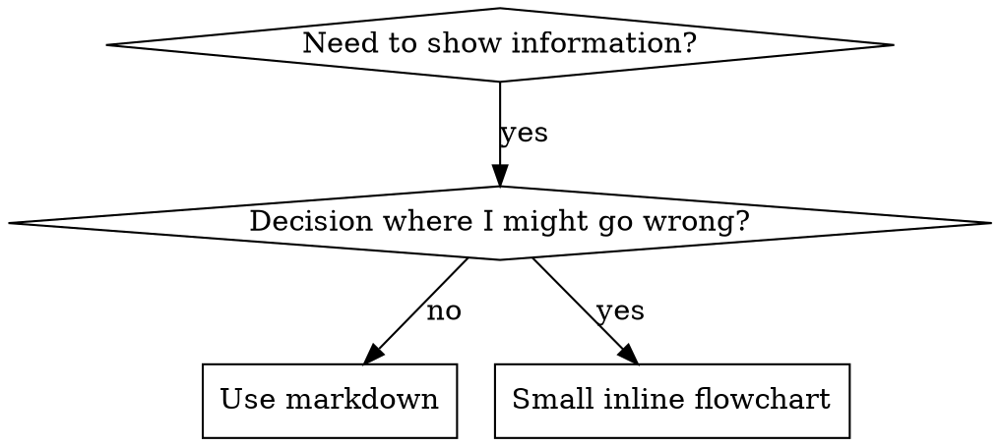

# Escrevendo Skills

## Visão Geral

**Escrever skills É Test-Driven Development aplicado à documentação de processos.**

**Skills pessoais vivem em diretórios específicos do agente (`~/.claude/skills` para Claude Code, `~/.codex/skills` para Codex)**

Você escreve casos de teste (cenários de pressão com subagentes), os vê falhar (comportamento inicial), escreve a skill (documentação), os vê passar (agentes obedecem), e refatora (fecha lacunas).

**Princípio central:** Se você não assistiu um agente falhar sem a skill, você não sabe se a skill ensina a coisa certa.

**BACKGROUND OBRIGATÓRIO:** Você DEVE compreender superpowers:test-driven-development antes de usar essa skill. Aquela skill define o ciclo fundamental RED-GREEN-REFACTOR. Esta skill adapta TDD para documentação.

**Orientação oficial:** Para as melhores práticas oficiais de criação de skills da Anthropic, veja anthropic-best-practices.md. Este documento fornece padrões e diretrizes adicionais que complementam a abordagem focada em TDD nessa skill.

## O que é uma Skill?

Uma **skill** é um guia de referência para técnicas comprovadas, padrões ou ferramentas. Skills ajudam futuras instâncias do Claude a encontrar e aplicar abordagens eficazes.

**Skills são:** Técnicas reutilizáveis, padrões, ferramentas, guias de referência

**Skills NÃO são:** Narrativas sobre como você resolveu um problema uma vez

## Mapeamento TDD para Criação de Skills

| Conceito TDD            | Criação de Skill                                 |
| ----------------------- | ------------------------------------------------ |
| **Caso de teste**       | Cenário de pressão com subagente                 |
| **Código de produção**  | Documento skill (SKILL.md)                       |
| **Teste falha (RED)**   | Agente viola regra sem skill (baseline)          |
| **Teste passa (GREEN)** | Agente obedece com skill presente                |
| **Refactor**            | Fecha lacunas mantendo conformidade               |
| **Escrever teste primeiro** | Rodar cenário baseline ANTES de escrever skill |
| **Observar falha**      | Documentar racionalizações exatas que agente usa |
| **Código mínimo**       | Escrever skill endereçando essas violações específicas |
| **Observar passar**     | Verificar que agente agora obedece               |
| **Ciclo refactor**      | Encontrar novas racionalizações → fechar → re-verificar |

Todo o processo de criação de skill segue RED-GREEN-REFACTOR.

## Quando Criar uma Skill

**Criar quando:**

- Técnica não era intuitivamente óbvia para você
- Você consultaria isso novamente em projetos diferentes
- Padrão se aplica amplamente (não específico do projeto)
- Outros se beneficiariam

**Não criar para:**

- Soluções únicas
- Práticas padrão bem documentadas em outro lugar
- Convenções específicas do projeto (coloque em CLAUDE.md)
- Restrições mecânicas (se é executável com regex/validação, automatize—reserve documentação para julgamentos)

## Tipos de Skill

### Técnica

Método concreto com passos a seguir (condition-based-waiting, root-cause-tracing)

### Padrão

Forma de pensar sobre problemas (flatten-with-flags, test-invariants)

### Referência

Docs de API, guias de sintaxe, documentação de ferramentas (office docs)

## Estrutura de Diretórios

```
skills/
  skill-name/
    SKILL.md              # Referência principal (obrigatório)
    supporting-file.*     # Apenas se necessário
```

**Namespace plano** - todas as skills em um namespace pesquisável

**Arquivos separados para:**

1. **Referência pesada** (100+ linhas) - Docs de API, sintaxe abrangente
2. **Ferramentas reutilizáveis** - Scripts, utilitários, templates

**Mantenha inline:**

- Princípios e conceitos
- Padrões de código (< 50 linhas)
- Tudo mais

## Defina Graus Apropriados de Liberdade

Alinhe o nível de especificidade à fragilidade e variabilidade da tarefa:

- **Alta liberdade (instruções baseadas em texto)**: Use quando múltiplas abordagens são válidas ou decisões dependem de contexto.
- **Liberdade média (pseudocódigo ou scripts com parâmetros)**: Use quando um padrão preferido existe mas algumas variações são aceitáveis.
- **Baixa liberdade (scripts específicos, instruções sem contexto)**: Use quando operações são frágeis, propensas a erro, ou consistência é crítica.

## Revelação Progressiva

Gerencie contexto eficientemente ao dividir informações detalhadas em arquivos separados:

1. **Metadados (nome + descrição)**: Sempre carregado para discovery.
2. **Corpo SKILL.md**: Workflow central e orientação de alto nível. Mantenha sob 500 linhas.
3. **Recursos agregados**:
   - `scripts/`: Código/lógica determinística.
   - `references/`: Schemas detalhados, docs de API, ou conhecimento de domínio.
   - `assets/`: Templates, imagens, ou arquivos estáticos.

**Padrão**: Vincule conteúdo avançado ou detalhes específicos de variantes (ex: `aws.md` vs `gcp.md`) do `SKILL.md` principal.

## Estrutura SKILL.md

**Frontmatter (YAML):**

- Apenas dois campos suportados: `name` e `description`
- Máximo 1024 caracteres total
- `name`: Use apenas letras, números e hífens (sem parênteses, caracteres especiais)
- `description`: Terceira pessoa, descreve APENAS quando usar (NÃO o que faz)
  - Comece com "Use when..." para focar em condições de ativação
  - Inclua sintomas, situações e contextos específicos
  - **NUNCA resuma o processo ou workflow da skill** (veja seção CSO para o porquê)
  - Mantenha sob 500 caracteres se possível

```markdown
---
name: Skill-Name-With-Hyphens
description: Use when [specific triggering conditions and symptoms]
---

# Nome da Skill

## Visão Geral

O que é isso? Princípio central em 1-2 frases.

## Quando Usar

[Pequeno fluxograma inline SE decisão não for óbvia]

Lista com SINTOMAS e casos de uso
Quando NÃO usar

## Padrão Central (para técnicas/padrões)

Comparação antes/depois de código

## Referência Rápida

Tabela ou bullets para scanning de operações comuns

## Implementação

Código inline para padrões simples
Link para arquivo para referência pesada ou ferramentas reutilizáveis

## Erros Comuns

O que dá errado + correções

## Impacto no Mundo Real (opcional)

Resultados concretos
```

## Otimização de Busca Claude (CSO)

**Crítico para discovery:** Claude futuro precisa ENCONTRAR sua skill

### 1. Campo de Descrição Rico

**Propósito:** Claude lê descrição para decidir quais skills carregar para uma tarefa. Faça-a responder: "Devo ler essa skill agora?"

**Formato:** Comece com "Use when..." para focar em condições de ativação

**CRÍTICO: Descrição = Quando Usar, NÃO O que a Skill Faz**

A descrição deve APENAS descrever condições de ativação. NÃO resuma o processo ou workflow da skill na descrição.

**Por que isso importa:** Testes revelaram que quando uma descrição resume o workflow da skill, Claude pode seguir a descrição em vez de ler o conteúdo completo. Uma descrição dizendo "revisão de código entre tarefas" causou Claude fazer UMA revisão, mesmo que o fluxograma da skill claramente mostrasse DUAS revisões (conformidade de spec depois qualidade de código).

Quando a descrição foi mudada para apenas "Use when executing implementation plans with independent tasks" (sem resumo de workflow), Claude corretamente leu o fluxograma e seguiu o processo de revisão de dois estágios.

**A armadilha:** Descrições que resumem workflow criam um atalho que Claude vai levar. O corpo da skill se torna documentação que Claude pula.

```yaml
# ❌ RUIM: Resume workflow - Claude pode seguir isso em vez de ler skill
description: Use when executing plans - dispatches subagent per task with code review between tasks

# ❌ RUIM: Muitos detalhes de processo
description: Use for TDD - write test first, watch it fail, write minimal code, refactor

# ✅ BOM: Apenas condições de ativação, sem resumo de workflow
description: Use when executing implementation plans with independent tasks in the current session

# ✅ BOM: Apenas condições de ativação
description: Use when implementing any feature or bugfix, before writing implementation code
```

**Conteúdo:**

- Use triggers concretos, sintomas e situações que sinalizam que essa skill se aplica
- Descreva o _problema_ (race conditions, comportamento inconsistente) não _sintomas específicos de linguagem_ (setTimeout, sleep)
- Mantenha triggers agnósticos de tecnologia a menos que a skill em si seja específica de tecnologia
- Se skill é específica de tecnologia, deixe isso explícito no trigger
- Escreva em terceira pessoa (injetado em system prompt)
- **NUNCA resuma o processo ou workflow da skill**

```yaml
# ❌ RUIM: Muito abstrato, vago, não inclui quando usar
description: For async testing

# ❌ RUIM: Primeira pessoa
description: I can help you with async tests when they're flaky

# ❌ RUIM: Menciona tecnologia mas skill não é específica para ela
description: Use when tests use setTimeout/sleep and are flaky

# ✅ BOM: Começa com "Use when", descreve problema, sem workflow
description: Use when tests have race conditions, timing dependencies, or pass/fail inconsistently

# ✅ BOM: Skill específica de tecnologia com trigger explícito
description: Use when using React Router and handling authentication redirects
```

### 2. Cobertura de Palavras-chave

Use palavras que Claude buscaria:

- Mensagens de erro: "Hook timed out", "ENOTEMPTY", "race condition"
- Sintomas: "flaky", "hanging", "zombie", "pollution"
- Sinônimos: "timeout/hang/freeze", "cleanup/teardown/afterEach"
- Ferramentas: Comandos reais, nomes de biblioteca, tipos de arquivo

### 3. Nomenclatura Descritiva

**Use voz ativa, verbo primeiro:**

- ✅ `creating-skills` não `skill-creation`
- ✅ `condition-based-waiting` não `async-test-helpers`

### 4. Eficiência de Tokens (Crítico)

**Problema:** skills getting-started e frequentemente-referenciadas carregam em TODA conversa. Cada token conta.

**Contagem de palavras alvo:**

- Workflows getting-started: <150 palavras cada
- Skills frequentemente-carregadas: <200 palavras total
- Outras skills: <500 palavras (ainda seja conciso)

**Técnicas:**

**Mova detalhes para ajuda de ferramenta:**

```bash
# ❌ RUIM: Documente todas as flags em SKILL.md
search-conversations supports --text, --both, --after DATE, --before DATE, --limit N

# ✅ BOM: Referencie --help
search-conversations supports multiple modes and filters. Run --help for details.
```

**Use referências cruzadas:**

```markdown
# ❌ RUIM: Repita detalhes de workflow

When searching, dispatch subagent with template...
[20 linhas de instruções repetidas]

# ✅ BOM: Referencie outra skill

Always use subagents (50-100x context savings). REQUIRED: Use [other-skill-name] for workflow.
```

**Comprima exemplos:**

```markdown
# ❌ RUIM: Exemplo verboso (42 palavras)

your human partner: "How did we handle authentication errors in React Router before?"
You: I'll search past conversations for React Router authentication patterns.
[Dispatch subagent with search query: "React Router authentication error handling 401"]

# ✅ BOM: Exemplo mínimo (20 palavras)

Partner: "How did we handle auth errors in React Router?"
You: Searching...
[Dispatch subagent → synthesis]
```

**Elimine redundância:**

- Não repita o que está em skills referenciadas
- Não explique o que é óbvio a partir do comando
- Não inclua múltiplos exemplos do mesmo padrão

**Verificação:**

```bash
wc -w skills/path/SKILL.md
# workflows getting-started: aim for <150 each
# Other frequently-loaded: aim for <200 total
```

**Nomeie pelo que você FAZ ou insight central:**

- ✅ `condition-based-waiting` > `async-test-helpers`
- ✅ `using-skills` não `skill-usage`
- ✅ `flatten-with-flags` > `data-structure-refactoring`
- ✅ `root-cause-tracing` > `debugging-techniques`

**Gerúndios (-ing) funcionam bem para processos:**

- `creating-skills`, `testing-skills`, `debugging-with-logs`
- Ativo, descreve a ação que você está tomando

### 4. Referenciação Cruzada de Outras Skills

**Ao escrever documentação que referencia outras skills:**

Use apenas nome da skill, com marcadores de requisito explícitos:

- ✅ Bom: `**REQUIRED SUB-SKILL:** Use superpowers:test-driven-development`
- ✅ Bom: `**REQUIRED BACKGROUND:** You MUST understand superpowers:systematic-debugging`
- ❌ Ruim: `See skills/testing/test-driven-development` (não fica claro se obrigatório)
- ❌ Ruim: `@skills/testing/test-driven-development/SKILL.md` (força-carrega, queima contexto)

**Por que não links @:** Sintaxe `@` força-carrega arquivos imediatamente, consumindo 200k+ contexto antes de você precisar.

## Uso de Fluxogramas



**Use fluxogramas APENAS para:**

- Pontos de decisão não-óbvios
- Loops de processo onde você pode parar cedo
- Decisões "Quando usar A vs B"

**Nunca use fluxogramas para:**

- Material de referência → Tabelas, listas
- Exemplos de código → Blocos markdown
- Instruções lineares → Listas numeradas
- Labels sem significado semântico (step1, helper2)

Veja @graphviz-conventions.dot para regras de estilo graphviz.

**Visualizando para seu parceiro humano:** Use `render-graphs.js` neste diretório para renderizar fluxogramas da skill para SVG:

```bash
./render-graphs.js ../some-skill           # Cada diagrama separadamente
./render-graphs.js ../some-skill --combine # Todos os diagramas em um SVG
```

## Exemplos de Código

**Um excelente exemplo bate muitos mediocres**

Escolha linguagem mais relevante:

- Técnicas de teste → TypeScript/JavaScript
- Debugging de sistema → Shell/Python
- Processamento de dados → Python

**Bom exemplo:**

- Completo e executável
- Bem-comentado explicando POR QUE
- De cenário real
- Mostra padrão claramente
- Pronto para adaptar (não template genérico)

**Não:**

- Implemente em 5+ linguagens
- Crie templates preencha-os-espaços
- Escreva exemplos contritos

Você é bom em portar - um ótimo exemplo é suficiente.

## Organização de Arquivos

### Skill Autossuficiente

```
defense-in-depth/
  SKILL.md    # Tudo inline
```

Quando: Todo conteúdo cabe, nenhuma referência pesada necessária

### Skill com Ferramenta Reutilizável

```
condition-based-waiting/
  SKILL.md    # Visão geral + padrões
  example.ts  # Helpers de trabalho para adaptar
```

Quando: Ferramenta é código reutilizável, não apenas narrativa

### Skill com Referência Pesada

```
pptx/
  SKILL.md       # Visão geral + workflows
  pptxgenjs.md   # 600 linhas de referência de API
  ooxml.md       # 500 linhas de estrutura XML
  scripts/       # Ferramentas executáveis
```

Quando: Material de referência muito grande para inline

## A Lei de Ferro (Mesma que TDD)

```
NENHUMA SKILL SEM UM TESTE FALHANDO PRIMEIRO
```

Isso se aplica a skills NOVAS E EDIÇÕES de skills existentes.

Escrever skill antes de testar? Delete-a. Comece de novo.
Editar skill sem testar? Mesma violação.

**Sem exceções:**

- Não para "adições simples"
- Não para "apenas adicionar uma seção"
- Não para "atualizações de documentação"
- Não mantenha mudanças não-testadas como "referência"
- Não "adapte" enquanto roda testes
- Deletar significa deletar

**BACKGROUND OBRIGATÓRIO:** A skill superpowers:test-driven-development explica por que isso importa. Os mesmos princípios se aplicam à documentação.

## Testando Todos os Tipos de Skill

Diferentes tipos de skill precisam de diferentes abordagens de teste:

### Skills que Reforçam Disciplina (regras/requisitos)

**Exemplos:** TDD, verification-before-completion, designing-before-coding

**Teste com:**

- Questões acadêmicas: Eles compreendem as regras?
- Cenários de pressão: Eles obedecem sob estresse?
- Múltiplas pressões combinadas: tempo + custo afundado + exaustão
- Identifique racionalizações e adicione contadores explícitos

**Critério de sucesso:** Agente segue regra sob pressão máxima

### Skills de Técnica (guias como fazer)

**Exemplos:** condition-based-waiting, root-cause-tracing, defensive-programming

**Teste com:**

- Cenários de aplicação: Conseguem aplicar técnica corretamente?
- Cenários de variação: Conseguem lidar com edge cases?
- Testes de informação faltante: Instruções têm lacunas?

**Critério de sucesso:** Agente aplica com sucesso técnica a novo cenário

### Skills de Padrão (modelos mentais)

**Exemplos:** reducing-complexity, conceitos information-hiding

**Teste com:**

- Cenários de reconhecimento: Reconhecem quando padrão se aplica?
- Cenários de aplicação: Conseguem usar modelo mental?
- Contra-exemplos: Sabem quando NÃO aplicar?

**Critério de sucesso:** Agente corretamente identifica quando/como aplicar padrão

### Skills de Referência (documentação/APIs)

**Exemplos:** Documentação de API, referências de comando, guias de biblioteca

**Teste com:**

- Cenários de recuperação: Conseguem encontrar informação certa?
- Cenários de aplicação: Conseguem usar o que encontraram corretamente?
- Testes de lacuna: Casos de uso comuns estão cobertos?

**Critério de sucesso:** Agente encontra e aplica corretamente informação de referência

## Racionalizações Comuns para Pular Testes

| Desculpa                       | Realidade                                                           |
| ------------------------------ | ------------------------------------------------------------------- |
| "Skill é obviamente clara"     | Claro para você ≠ claro para outros agentes. Teste-a.               |
| "É apenas uma referência"      | Referências podem ter lacunas, seções pouco claras. Teste retrieval. |
| "Testar é exagero"             | Skills não-testadas sempre têm problemas. 15 min teste economiza horas. |
| "Testarei se problemas emergirem" | Problemas = agentes não conseguem usar skill. Teste ANTES de deploy. |
| "Muito tedioso para testar"    | Testar é menos tedioso que debugar skill ruim em produção.          |
| "Tenho confiança que é bom"    | Excesso de confiança garante problemas. Teste mesmo assim.          |
| "Revisão acadêmica é suficiente" | Ler ≠ usar. Teste cenários de aplicação.                           |
| "Sem tempo para testar"        | Fazer deploy de skill não-testada desperdiça mais tempo consertando-a. |

**Todos estes significam: Teste antes de fazer deploy. Sem exceções.**

## À Prova de Rationalização de Skills

Skills que reforçam disciplina (como TDD) precisam resistir a rationalização. Agentes são inteligentes e encontrarão lacunas quando sob pressão.

**Nota de psicologia:** Compreender POR QUE técnicas de persuasão funcionam ajuda você aplicá-las sistematicamente. Veja persuasion-principles.md para fundação de pesquisa (Cialdini, 2021; Meincke et al., 2025) em autoridade, commitment, escassez, prova social, e princípios de unidade.

### Feche Toda Lacuna Explicitamente

Não apenas declare a regra - proíba truques específicos:

<Ruim>
```markdown
Write code before test? Delete it.
```
</Ruim>

<Bom>
```markdown
Write code before test? Delete it. Start over.

**No exceptions:**

- Don't keep it as "reference"
- Don't "adapt" it while writing tests
- Don't look at it
- Delete means delete

```
</Bom>

### Endereçar Argumentos "Espírito vs Letra"

Adicione princípio fundacional cedo:

```markdown
**Violating the letter of the rules is violating the spirit of the rules.**
```

Isso corta classe inteira de racionalizações "Estou seguindo o espírito".

### Construa Tabela de Rationalização

Capture racionalizações de teste baseline (veja seção Testing abaixo). Toda desculpa que agentes fazem vai na tabela:

```markdown
| Desculpa                         | Realidade                                                               |
| -------------------------------- | ----------------------------------------------------------------------- |
| "Muito simples para testar"      | Código simples quebra. Teste leva 30 segundos.                          |
| "Testarei depois"                | Testes passando imediatamente não provam nada.                          |
| "Testes depois atingem os mesmos objetivos" | Testes-depois = "o que isso faz?" Testes-primeiro = "o que deve fazer?" |
```

### Crie Lista de Red Flags

Facilite que agentes se auto-verifiquem quando racionalizando:

```markdown
## Red Flags - STOP e Comece de Novo

- Code before test
- "I already manually tested it"
- "Tests after achieve the same purpose"
- "It's about spirit not ritual"
- "This is different because..."

**All of these mean: Delete code. Start over with TDD.**
```

### Atualize CSO para Sintomas de Violação

Adicione à descrição: sintomas de quando você está PRESTES a violar a regra:

```yaml
description: use when implementing any feature or bugfix, before writing implementation code
```

## RED-GREEN-REFACTOR para Skills

Siga o ciclo TDD:

### RED: Escrever Teste Falhando (Baseline)

Rodar cenário de pressão com subagente SEM a skill. Documentar comportamento exato:

- Que escolhas fizeram?
- Que racionalizações usaram (verbatim)?
- Quais pressões dispararam violações?

Isso é "observar o teste falhar" - você deve ver o que agentes naturalmente fazem antes de escrever a skill.

### GREEN: Escrever Skill Mínima

Escrever skill que endereça essas racionalizações específicas. Não adicione conteúdo extra para casos hipotéticos.

Rodar mesmos cenários COM skill. Agente deve agora obedecer.

### REFACTOR: Fechar Lacunas

Agente encontrou nova rationalização? Adicione contador explícito. Re-teste até à prova de bala.

**Metodologia de teste:** Veja @testing-skills-with-subagents.md para metodologia completa de teste:

- Como escrever cenários de pressão
- Tipos de pressão (tempo, custo afundado, autoridade, exaustão)
- Fechando buracos sistematicamente
- Técnicas de meta-teste

## Anti-Padrões

### ❌ Exemplo Narrativo

"Em sessão 2025-10-03, descobrimos que projectDir vazio causava..."
**Por que ruim:** Muito específico, não reutilizável

### ❌ Dilução Multi-Linguagem

example-js.js, example-py.py, example-go.go
**Por que ruim:** Qualidade mediocre, carga de manutenção

### ❌ Código em Fluxogramas

```dot
step1 [label="import fs"];
step2 [label="read file"];
```

**Por que ruim:** Não consegue copiar-colar, difícil de ler

### ❌ Labels Genéricos

helper1, helper2, step3, pattern4
**Por que ruim:** Labels devem ter significado semântico

## PARE: Antes de Mover para Próxima Skill

**Depois de escrever QUALQUER skill, você DEVE PARAR e completar o processo de deployment.**

**NÃO:**

- Crie múltiplas skills em batch sem testar cada uma
- Mude para próxima skill antes da atual estar verificada
- Pule testes porque "batching é mais eficiente"

**O checklist de deployment abaixo é OBRIGATÓRIO para CADA skill.**

Fazer deploy de skills não-testadas = fazer deploy de código não-testado. É uma violação de padrões de qualidade.

## Checklist de Criação de Skill (TDD Adaptado)

**IMPORTANTE: Use TodoWrite para criar todos para CADA item de checklist abaixo.**

**Fase RED - Escrever Teste Falhando:**

- [ ] Criar cenários de pressão (3+ pressões combinadas para skills de disciplina)
- [ ] Rodar cenários SEM skill - documentar comportamento baseline verbatim
- [ ] Identificar padrões em racionalizações/falhas

**Fase GREEN - Escrever Skill Mínima:**

- [ ] Nome usa apenas letras, números, hífens (sem parênteses/caracteres especiais)
- [ ] Frontmatter YAML com apenas name e description (máx 1024 chars)
- [ ] Description começa com "Use when..." e inclui triggers/sintomas específicos
- [ ] Description escrita em terceira pessoa
- [ ] Palavras-chave ao longo de tudo para busca (erros, sintomas, ferramentas)
- [ ] Visão geral clara com princípio central
- [ ] Endereçar falhas baseline específicas identificadas em RED
- [ ] Código inline OU link para arquivo separado
- [ ] Um excelente exemplo (não multi-linguagem)
- [ ] Rodar cenários COM skill - verificar que agentes agora obedecem

**Fase REFACTOR - Fechar Lacunas:**

- [ ] Identificar NOVAS racionalizações do teste
- [ ] Adicionar contadores explícitos (se skill de disciplina)
- [ ] Construir tabela de rationalização de todas iterações de teste
- [ ] Criar lista de red flags
- [ ] Re-testar até à prova de bala

**Verificações de Qualidade:**

- [ ] Pequeno fluxograma apenas se decisão não-óbvia
- [ ] Tabela de referência rápida
- [ ] Seção de erros comuns
- [ ] Sem narrativa de storytelling
- [ ] Arquivos de suporte apenas para ferramentas ou referência pesada

**Deployment:**

- [ ] Commit skill para git e push para seu fork (se configurado)
- [ ] Considere contribuir de volta via PR (se amplamente útil)

## Workflow de Discovery

Como Claude futuro encontra sua skill:

1. **Encontra problema** ("testes são flaky")
2. **Encontra SKILL** (descrição combina)
3. **Escaneia visão geral** (isso é relevante?)
4. **Lê padrões** (tabela de referência rápida)
5. **Carrega exemplo** (apenas quando implementando)

**Otimize para este fluxo** - coloque termos pesquisáveis cedo e frequentemente.

## A Mensagem Principal

**Criar skills É TDD para documentação de processo.**

Mesma Lei de Ferro: Nenhuma skill sem teste falhando primeiro.
Mesmo ciclo: RED (baseline) → GREEN (escrever skill) → REFACTOR (fechar lacunas).
Mesmos benefícios: Melhor qualidade, menos surpresas, resultados à prova de bala.

Se você segue TDD para código, siga para skills. É a mes