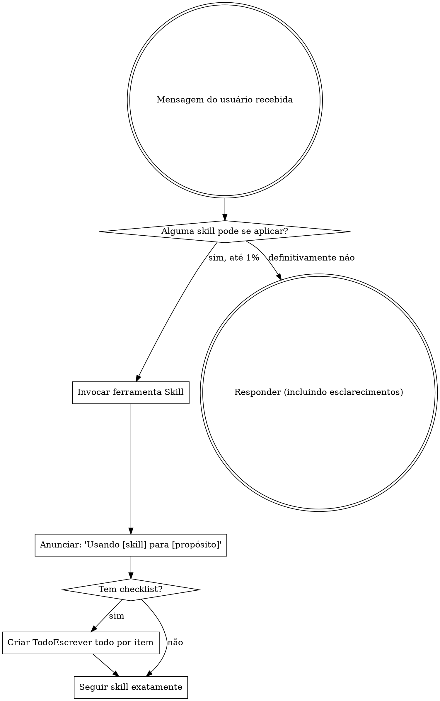

<EXTREMELY-IMPORTANT>
Se você achar que existe até 1% de chance de uma skill se aplicar ao que você está fazendo, você ABSOLUTAMENTE DEVE invocar a skill.

SE UMA SKILL SE APLICA À SUA TAREFA, VOCÊ NÃO TEM ESCOLHA. VOCÊ DEVE USÁ-LA.

Isto não é negociável. Isto não é opcional. Você não pode racionalizar sua forma de sair disso.
</EXTREMELY-IMPORTANT>

## Como Acessar Skills

**Em Claude Code:** Use a ferramenta `Skill`. Quando você invoca uma skill, seu conteúdo é carregado e apresentado a você — siga-o diretamente. Nunca use a ferramenta Read em arquivos de skill.

**Em outros ambientes:** Consulte a documentação da sua plataforma para saber como skills são carregadas.

# Usando Skills

## A Regra

**Invoque skills relevantes ou solicitadas ANTES de qualquer resposta ou ação.** Até 1% de chance de uma skill se aplicar significa que você deve invocar a skill para verificar. Se uma skill invocada se mostrar errada para a situação, você não precisa usá-la.

## Sinais de Alerta

Estes pensamentos significam PARE — você está racionalizando:

| Pensamento | Realidade |
|---------|---------|
| "Isto é apenas uma pergunta simples" | Perguntas são tarefas. Verifique skills. |
| "Preciso de mais contexto primeiro" | Verificação de skill vem ANTES de perguntas de esclarecimento. |
| "Deixe-me explorar a base de código primeiro" | Skills dizem COMO explorar. Verifique primeiro. |
| "Posso verificar git/arquivos rapidamente" | Arquivos carecem de contexto de conversa. Verifique skills. |
| "Deixe-me coletar informações primeiro" | Skills dizem COMO coletar informações. |
| "Isto não precisa de uma skill formal" | Se uma skill existe, use-a. |
| "Lembro desta skill" | Skills evoluem. Leia a versão atual. |
| "Isto não conta como uma tarefa" | Ação = tarefa. Verifique skills. |
| "A skill é exagerada" | Coisas simples ficam complexas. Use-a. |
| "Vou fazer apenas isto primeiro" | Verifique ANTES de fazer qualquer coisa. |
| "Isto parece produtivo" | Ação indisciplinada desperdiça tempo. Skills previnem isto. |
| "Conheço o que isto significa" | Conhecer o conceito ≠ usar a skill. Invoque-a. |

## Prioridade de Skill

Quando múltiplas skills podem se aplicar, use esta ordem:

1. **Skills de processo primeiro** (brainstorming, debugging) - estas determinam COMO abordar a tarefa
2. **Skills de implementação segundo** (frontend-design, mcp-builder) - estas guiam a execução

"Vamos construir X" → brainstorming primeiro, depois skills de implementação.
"Corrija este bug" → debugging primeiro, depois skills específicas do domínio.

## Tipos de Skill

**Rígidas** (TDD, debugging): Siga exatamente. Não adapte longe da disciplina.

**Flexíveis** (padrões): Adapte princípios ao contexto.

A skill em si diz qual é.

## Instruções do Usuário

Instruções dizem O QUÊ, não COMO. "Adicione X" ou "Corrija Y" não significa pule workflows.